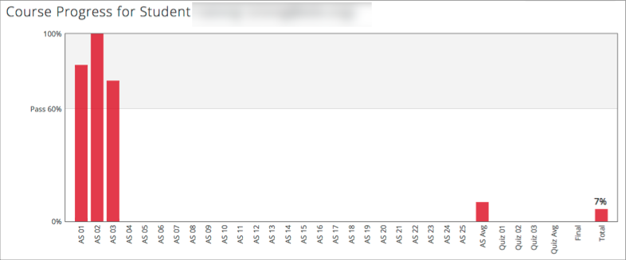
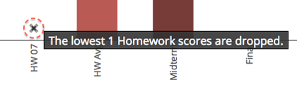
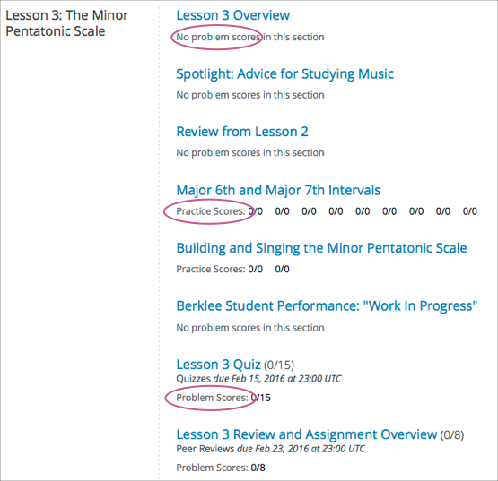

.. _SFD Check Progress:

##################################
Checking Your Progress in a Course
##################################

This topic describes how to check and understand your progress in a course.

.. contents::
  :local:
  :depth: 2

******************
The Progress Page
******************

As you work through a course, you can track your the scores on individual
problems as well as your current overall course grade. Select **Progress** in
any course.

===============
Grading Chart
===============

On the **Progress** page, a chart shows how you have performed for each graded
assignment in the course.

Assignments are listed along the horizontal axis, and the percentage score
that you received in each lesson is read from the vertical axis.

    horizontal axis, and percentage scores on the vertical axis.

Markers on the vertical axis reflect the grading scale for the course. For
example, if the passing percentage score for the course is 60%, there is a
marker on the vertical axis at 60% so that you can compare your total score
with the required passing score. If the course awards a grade of B for scores
of 50% and higher, and a grade of A for scores 75% and higher, then there are
markers on the vertical axis at 50% and 75%, labelled "B" and "A"
respectively.

.. note::
   In the progress chart, assignments are grouped by type. For example,
   all homework sections are listed together, then all quizzes, then exams. A
   bar showing the average score for each assignment type appears for each
   group.

The bar for each assignment reflects your total score for all the problems in
that assignment. For individual problem scores, see :ref:`Grading Details`
below the chart. For each of the assignment types, an "average" bar shows the
current average of scores for assignments of that type. This average is
recalculated as you progress through the course and complete more assignments.

.. note::
   In some courses, results for some assignments are hidden. For
   example, the results of an exam might be hidden until after the exam's due
   date. When the results are hidden, you do not see whether you answered
   problems correctly, and you do not see your score in the body of the course
   or on your **Progress** page.

Some courses allow some number of graded assignments to be automatically
dropped from your final score. For example, out of 8 quizzes, a course might
have the lowest scoring quiz excluded from all learners' final scores. A
dropped assignment is indicated in the chart by an **x** above the horizontal
axis.

   whose score has been dropped.

.. _Grading Details:

================
Grading Details
================

The **Progress** page includes your scores for individual problems within an
assignment. Below the grading chart is a listing of course sections in the
order that they occur in the course.

For each problem in a graded assignment, the points that you earned out of the
possible points is shown with the label **Problem Scores**. Scores for
ungraded problems are shown with the label **Practice Scores**. Sections that
do not have any problems are labelled as having no problem scores.

.. SP, 4/24/17 - Currently, problem results are visible on the Progress page
.. and in this section even if they're hidden in the body of the course. Add
.. the following note when they are no longer visible:

.. note

.. In some courses, results for some assignments are hidden. When results are
.. hidden, you do not see whether you answered problems correctly, and you do
.. not see a score for the assignment in the body of the course. Additionally,
.. the results for the assignment are not visible in your progress chart or in
.. the grading details for the assignment.

   showing earned and possible points for each graded problem.
