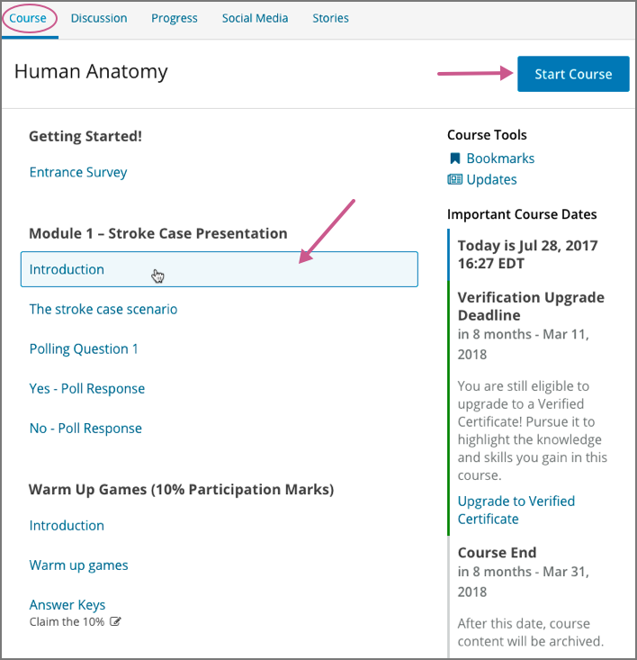

.. _course_content_availability:

##########################
Accessing Course Content
##########################

To access course content in a course that has :ref:`started<Start Date and
Duration>`, open the course and go to the **Course** page.

Below any messages from the course team, you see the course outline.

     Course button.

Click **Start Course** to go to the first section of the course, or select any
part of the course to jump to it. If you have already accessed or worked in
the course, click **Resume Course** to jump to the part of the course that you
last accessed.

********************************************************
Course Content Can Be Released At Different Times
********************************************************

Be aware that in some courses, not all of the the course content is available
when the course starts. or even at any one time during the course. Instead,
additional content might become available at different times in the course, or
as you progress through the course.

Course content might become available in the course at different times for
various reasons, including the following reasons.

* The course team has scheduled specific content for release on specific
  dates. That content is added to the course outline only on the date
  that the course team chooses.

* The course team might make certain course content unavailable after certain
  points in the course. For example, after an assignment's due date has
  passed, or after the end date of a self-paced course, the assignment might
  no longer be available.

* Some courses include content that has prerequisite sections. Prerequisite
  sections require that you complete other, previous sections before they
  become available. The course team sets a minimum score that you must earn in
  the problems of a prerequisite section in order to display the following
  sections.

Not all courses include scheduled course content or prerequisites. Your course
might display all of the course content on the **Course** page as soon as the
course starts.

If you do not see the course content that you expect, you can check for
information about the course schedule and content prerequisites in updates on
the **Course** page, or you can ask questions in the course discussions.
