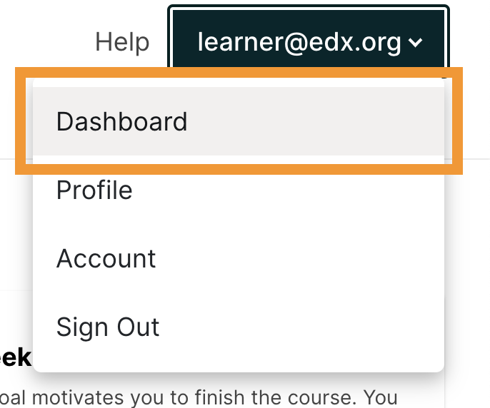

.. This content is used as "include" in both the Learner's Guide and Building
.. and Running Guide. SFD_dashboard_profile_SectionHead and
.. CA_dashboard_profile_SectionHead files.

You can access course, account, or profile information from any page on the
website, whether you are in a course or browsing the course catalog. Select the
dropdown menu icon next to your username, and then choose one of the following
menu options.

* :ref:`Dashboard<SFD Learner Dashboard>` gives you access to the courses and
  programs that you have enrolled in, and to information such as course start
  and end dates, certificates, and email settings.

* :ref:`Profile <SFD Profile Page>` gives you the option to provide personal
  information about yourself that other course participants can see, such as an
  image and biographical information.

* :ref:`Account<SFD Update Account Settings>` gives you access to your account
  settings and preferences. For example, you can update your password or email
  address and set your :ref:`time zone<Time Zones>`.

  .. only:: Partners

    On the **Account Settings** page, you can also view your :ref:`edX order
    history<View Order History>` and link your edX account to a social media or
    organization account.

.. _SFD Learner Dashboard:

******************************************
Accessing Your Courses from the Dashboard
******************************************

Your dashboard lists all of the courses that you are enrolled in. When you
create an account or enroll in a course, you automatically go to your
dashboard. You can also access your dashboard by selecting the dropdown menu
icon next to your username at the top of any page.

     dropdown icon next to your username. The Dashboard option is circled, and
     the other options are Profile, Account, and Sign Out.

You can find information about your courses and change course-specific email
subscription settings on your dashboard. For more information, see :ref:`Find or
Change Course Information`.

.. only:: Partners

  Your dashboard has two pages.

  * The **Courses** page lists all the courses you have enrolled in, whether
    the course is current or has ended. The **Courses** page provides
    information about your courses and allows you to change course settings. By
    default, the dashboard opens to the **Courses** page.

  * The **Programs** page lists any programs, such as XSeries or MicroMasters
    programs, that edX offers for courses that you are enrolled in. Programs
    appear on this page if you are enrolled in any course that is part of that
    program. For more information, see :ref:`Programs Page`.

.. _Social Sharing:

======================================
Sharing Your Courses on Social Media
======================================

On your dashboard, you can share the courses you are enrolled in on social
media sites such as Facebook and Twitter.

.. only:: Open_edX

 This feature is available only if it has been enabled by your course provider.

#. Sign in to the social media site on which you want to share your course
   enrollment.

#. From your dashboard, find the course that you want to share.

#. Select the icon for the social media site where you want to share.
   A dialog box for the social media site you selected opens, with the course
   URL entered and a default social media message.

#. Optionally, modify the text of the social media message.

#. Select the appropriate button to publish your message on the social media
   site.

.. only:: Partners

  .. _Programs Page:

  =======================
  Explore edX Programs
  =======================

  The **Programs** page lists the :ref:`programs<About Programs>` that you have
  enrolled in. You see a program on this page if you are enrolled in any courses
  that are part of that program.

  On the **Programs** page, you can perform the following actions.

  * Access information about a program and enroll in more of the program's
    courses.

    To access information about a program, select that program. A page opens
    that provides details about the program, as well as links to enroll in courses in that program.

  * View your progress through the program.

    Under the name of the program are indications of your progress through the
    program. You see the number of courses in the program that you have
    completed, the number of courses in the program that you are enrolled in,
    and the number of courses in the program that you are not yet enrolled in.

  * Access any program certificates you have earned.

    In the right pane, a **Program Certificates** list shows the names of
    programs for which you have earned certificates. For more information about
    the program, or to view the certificate, select the name of the program.

.. _SFD Profile Page:

***************************
Adding Profile Information
***************************

Your personal profile allows you to specify information about yourself that you
want to share  with other participants in the courses that you take. Adding a
profile is optional. If you add profile information, course teams and other
learners in your courses can view the information that you share.

In addition to your username, your profile can include a picture, your
location, and other biographical information.

You can share either a limited profile or a full profile.

* A limited profile shares only your username and an optional profile picture.

  .. note:: If you are under 13 years of age, you can only share a limited
     profile. You cannot share a profile picture.

   .. image:: ../../shared/images/SFD_Prof_Limited.png
     :width: 400
     :alt: A learner's limited profile showing only username and image.

* A full profile includes biographical information in addition to your username
  and profile image.

  .. image:: ../../shared/images/SFD_Prof_Full.png
    :width: 500
    :alt: A learner's full profile with location, language, and short
     biographical paragraph.

.. _Create or Edit a Limited Profile:

================================
Add or Update a Limited Profile
================================

A limited profile includes only your username and, optionally, an image.

.. note:: If you are under 13 years of age, your limited profile only includes
   your username. You cannot add a profile picture.

To add or update a limited profile, follow these steps.

#. At the top of any page, select the dropdown menu icon next to your
   username.

#. Select **Profile**.

#. On your profile page, locate **learners can see my**, and then select
   **Limited Profile**.

#. (optional) Add an image that you want to associate with your username.
   Your image must be a .gif, .jpg, or .png file. The image must be between
   100 bytes and 1 MB in size. If you do not add an image, the placeholder
   image appears as your profile image.

   #. Move your cursor over the placeholder image, and then select **Upload
      Image**.

   #. In the dialog box, select the image file that you want, and then select
      **Open**.

   To change or remove your profile image, move your cursor over your image,
   and then select either **Change Image** or **Remove**. When you remove your
   profile image, the placeholder image appears as your profile image.

The site saves your changes automatically.

================================
Add or Update a Full Profile
================================

.. note:: You must specify your year of birth on the **Account Settings** page
   before you share a full profile. If you are under 13 years of age, you
   can share only a :ref:`limited profile <Create or Edit a Limited Profile>`.

A full profile can include the following information. Your username and
country or region are required.

* Your username.

* An image that you select to identify yourself.

* Your country or region.

* Your preferred language.

* A paragraph about yourself. You might include your interests, goals, or
  other information that you want to share. This paragraph can contain up to
  3000 characters.

To add or update your profile, follow these steps.

#. At the top of any page, select the dropdown menu icon next to your
   username.

#. Select **Profile**.

#. Locate **learners can see my**, and then select **Full Profile**.

#. On your profile page, move your cursor over the information that you
   want to add or change.

   If you have not added information to the field, the field appears
   highlighted and surrounded by a dashed line.

   .. image:: ../../shared/images/SFD_Prof_Add_Info.png
    :width: 300
    :alt: A profile page with the "Add language" field highlighted and
        surrounded by a dashed line.

   If the field already has information, the field appears highlighted, and a
   pencil icon appears.

   .. image:: ../../shared/images/SFD_Prof_Edit_Info.png
    :width: 500
    :alt: A profile page with the "About Me" field highlighted.

#. Move your cursor inside the field, and then either enter text in the field
   or select a different option from a list.

The site saves your changes automatically.

.. note:: If you change the profile type selection from **Full Profile**
 to **Limited Profile**, your location, language, and descriptive paragraph
 are not visible on your profile page. However, this information is saved. To
 make this information visible again, select **Full Profile**.

================================
View Another Learner's Profile
================================

You can view other learners' profiles through their posts, responses, or
comments in course discussions.

#. On the **Discussion** page, select the username of any learner in a post, a
   response, or a comment.

   A page that displays the discussion activity only for the selected learner
   opens.

#. On the learner's **Discussion** page, select their linked username.

The learner's account profile page opens.

.. _Find or Change Course Information:

*********************************
Updating Course-Specific Settings
*********************************

From the dashboard, access the courses that you are enrolled in and change
course-specific settings. You can also :ref:`unenroll from a course<Unenroll
from a Course>` from the dashboard.

.. _Change a Course Email Preference:

=================================
Change a Course Email Preference
=================================

To subscribe or unsubscribe to emails from a course, follow these steps.

#. On your dashboard, locate the course.

#. Select the course settings icon. The course settings icon resembles a gear
   and appears next to **View Course** or **View Archived Course**.

   .. image:: ../../shared/images/LearnDash_GearIcon.png
     :width: 200
     :alt: The course settings icon next to the View Course button on the
           learner dashboard.

#. Select **Email Settings**.

#. Select or clear the **Receive course emails** check box, and then select
   **Save Settings**.

   .. note:: If you clear this check box, you will not receive any of the
        email messages that course teams send to communicate with enrolled
        learners in the course.

