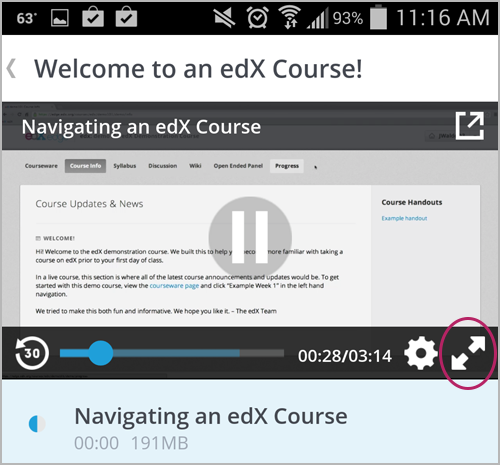

.. _SFD Mobile:

###############################
If You Use the edX Mobile App
###############################

This topic answers questions about how you can use the edX mobile app on an
Android smartphone or an iPhone to take edX courses.

.. contents::
  :local:
  :depth: 1

********************************************************
Overview of the edX Mobile App
********************************************************

.. only:: Partners

  The edX mobile app is a companion to the `edx.org`_ website.

You can use the app to download course videos so that you can watch them
whenever you want to, even without an Internet connection. When you have an
Internet connection, you can also read course announcements, participate in
course discussions, and get started on homework and other assignments. To
complete an entire course, you use a web browser on a computer.

.. The "General Questions" and "Getting Started" sections that follow apply only to edX partners/edx.org only

.. only:: Partners

 .. _General Questions:

 *************************
 General Questions
 *************************

 ================================
 How do I get the mobile app?
 ================================

 The Android app is available in the `Google Play`_ Store. The iPhone app is
 available in the Apple `App Store`_.

 ================================
 How much does the app cost?
 ================================

 The app is free. You do not have to pay or buy anything to download or use it.

 ========================================
 What platforms does the app run on?
 ========================================

 Right now, the edX mobile app is available for Android smartphones and
 iPhones. For the iPhone app, your device must be running iOS 7 or later.

 EdX plans to make the app available on Android tablets and iPads in the
 future.

 ================================================
 How can I send questions or comments to edX?
 ================================================

 EdX is glad to receive your feedback on the mobile app. On the **My Courses**
 page, select the menu in the upper left corner, and then select **Submit
 Feedback**.

 .. _Getting Started:

 *************************
 Getting Started
 *************************

 ======================================
 Do I need an edX account?
 ======================================

 You need to have an edX account before you can enroll in courses. On the
 Android version of the mobile app, you can browse course and view course
 details without an edX account and without logging in.

 You can register for an edX account in the edX mobile app, or use a browser to
 go to the `edx.org`_ website. When you create your account, you need to be
 connected to the Internet. For more information, see :ref:`Getting
 Started_account`.

 ======================================
 How do I create an edX account?
 ======================================

 Select **Register** in the edX mobile app. You can create an edX account using
 your email address or a linked social media account.

 When you create an account, you are asked for the following information.

 * Your full name.
 * The username that will identify you to course teams and to other learners.
 * A password.
 * Your country or region.

 .. note:: When you register an account, you specify a username that will
    represent you on edX. Your username, not your full name, is used to identify
    you to course team members and other learners. Your full name is used on any
    certificates that you earn. You cannot change your public username after you
    register. EdX recommends that you select your username carefully.

 ===========================================
 How do I create or edit my user profile?
 ===========================================

 After you have created and activated your edX account, you can edit your user
 profile. Your edX profile allows you to share information about yourself with
 the edX community. Course teams and other learners in your courses can view
 your profile when they select your linked username in forums. You can share
 either a limited profile or a full profile.

 Your profile always includes your username. A limited profile shares only your
 username and an optional profile picture. A full profile includes biographical
 information in addition to your username and profile image.

 .. note:: If you are under 13 years of age, you can only share a limited
    profile, and you cannot share a profile picture.

 To create or edit your profile details in the mobile app, select your username
 or profile picture. Select **Edit** to edit your profile details. In your  profile
 details, select **Change** next to the camera icon to change your profile
 picture.

 If you are over 13 years of age, you can share more information about yourself
 by changing your limited profile to a full profile. You can indicate your
 primary language and location and, in the **About Me** section, you can add
 additional details such as your learning goals and other interests. To share a
 full profile, select **Full Profile**.

 .. note:: You must specify your birth year before you can share a full
    profile. If you are under 13 years of age, you cannot create a full
    profile.

 ==================================================
 How do I find courses to take?
 ==================================================

 Almost all of the edX courses on edx.org are available on the edX mobile app.
 EdX is continually adding mobile courses, so check back regularly for newly
 available courses.

 On Android devices, you do not need to have an edX account or be logged in to
 browse courses. Select **Discover Courses** in the edX mobile app.

 On both Android and iOS devices, if you have an edX account and are logged in
 to the mobile app, select **Find Courses** in the menu to access the list of
 available courses.

 ==================================================
 How do I enroll in a course?
 ==================================================

 When you find a course that you want to take, select the course to view
 its details, including the course video. On the About page for each course,
 select **Enroll Now** to enroll in the course.

 For more information about enrolling and about course tracks, see :ref:`SFD
 Enrolling in a Course`.

 ========================================
 How do I unenroll from a course?
 ========================================

 To unenroll from a course, use a browser to go to the `edx.org`_ website. You
 unenroll from courses on your :ref:`dashboard<SFD Learner Dashboard>`.

.. The "Course Questions" section is for both partners and Open edX, except for the last topic, How do I Share a Link to a Course, which is currently for Open edX only. CT July 29, 2016

.. _Course Questions:

*************************
Course Questions
*************************

========================================================
Can I take a course entirely on my mobile device?
========================================================

The answer depends on the types of problems that are used in the course you are
taking. If a course contains mobile friendly problem types, you can complete
those types of problems using the mobile app. For a list of the types of
problems you can complete using the mobile app, see :ref:`What problems in
mobile app`. Timed exams and proctored exams cannot be taken using the mobile
app.

You can watch course videos on the mobile app, and can also download videos to
your mobile device for watching when you do not have an internet connection.
When you have an internet connection, you can also read course announcements,
participate in course discussions, and complete the mobile friendly problems
in your assignments.

To complete an entire course, you can use a web browser on a computer.

.. _Assessment Questions:

==================================================================
Can I use the edX mobile app to do my homework?
==================================================================

You can use the edX mobile app to do some, but not all, of the problems in
your assignments. EdX courses include a variety of problem types. Currently,
you can read questions and submit answers only for problem types that require
relatively simple actions as responses.

For example, you can use the edX app to answer multiple choice questions, but
you cannot use it to draw molecules or design circuits. To complete problems
that require complex actions, you must use a web browser.

.. note:: EdX recommends that you complete all of your graded assignments in
 a web browser on a computer.

.. _What problems in mobile app:

========================================================
What types of problems can I do in the mobile app?
========================================================

In the edX mobile app, you can do problems that you answer in one of these
ways.

* Checkbox selection
* Drag and drop selection
* Dropdown list selection
* Multiple choice selection
* Math expression input
* Numerical input
* Text input

Timed or proctored exams cannot be taken using the mobile app.

========================================================
How do I post questions on the discussion board?
========================================================

You can read and contribute to course discussions in the edX mobile apps
whenever you have an Internet connection. In your course, select
**Discussion**. You can then browse through different topics or search for
words or phrases that interest you. For information about course discussions,
see :ref:`Course Discussions Index`.

.. only:: Open_edX

 ==================================================
 How do I share a link to a course I am taking?
 ==================================================

 After you enroll in a course, you can let family and friends know about the
 course by sharing a link to it on a connected social account, or in an email
 message.

 From a course's main page, select the **Share** icon in the course's title
 display.

   .. image:: ../../shared/students/Images/SFD_Mobile_Course_Share.png
      :width: 300
      :alt: A course page on the mobile app, with the Share icon.

 On the page that opens, select how you want to share the link. For example,
 select **Facebook** to post a link to the course on your Facebook wall.

.. Video Questions section is for both partners and Open edX

.. _Video Questions:

*************************
Video Questions
*************************

================================
How do I download videos?
================================

To download videos, you must be connected to the Internet. Select the
"download" icon that appears to the right of a subsection or video name.

.. The following image includes section-level downloads, available to partners/edx.org (video only)
.. Alison, DOC-1840, June 2015

.. only:: Partners

  .. image:: ../../shared/students/Images/Mob_DownloadIcon.png
     :width: 300
     :alt: List of sections with the "download" icon circled.

* If you select download for a subsection, you download all of the videos in
  that subsection.

* If you select download for a video, you download only that video.

  This example lists subsections in a course and shows how many videos
  will download when you select the icon.

  .. image:: ../../shared/students/Images/Mob_DownloadIcon_openedX.png
    :width: 300
    :alt: List of subsections with the "download" icon circled.

To download videos, you must be connected to the Internet. After you download a
video, you can watch it at any time.

================================================
How much data will the videos in this app use?
================================================

Course videos are optimized for mobile playback, but watching or downloading
any video can result in heavy data use. EdX recommends using a Wi-Fi connection
if you intend to watch or download a lot of videos. The edX mobile apps have a
**Download only on Wi-Fi** setting that is enabled by default to help you avoid
using your cellular network accidentally.

==========================================================
What are the numbers to the right of subsection names?
==========================================================

The number to the right of a subsection name indicates the number of videos in
that subsection.

========================================
How can I make the video full screen?
========================================

Rotate your phone until the video changes to landscape mode, or select "full
screen" in the bottom right corner of the video player.

==================================
Can I speed up the videos?
==================================

You can change video speeds on the iPhone app. While a video plays, select
**Settings** (the "gear" icon) at the lower right, and then select **Video
Speed**.

On the Android app, videos currently play only at their original speeds.

========================================
How do I change my download settings?
========================================

#. On the **My Courses** page, select the menu in the upper left corner.

   .. image:: ../../shared/students/Images/Mob_Menu.png
      :width: 300
      :alt: Mobile "My Courses" page with an arrow pointing to the menu in the
        upper left corner.

#. Select **My Settings**.

#. Change the **Wi-Fi only download** setting.

.. note:: By default, the apps are set so that they only download content,
  including videos, if you are on a Wi-Fi network. If you change this setting,
  you might exceed the data allowance for your cellular plan.

==================================
How do I delete downloaded videos?
==================================

#. On the **My Courses** page, select the menu in the upper left corner.

#. Select **My Videos**.

#. On the **All Videos** page, select the course that has the video that you
   want to delete. Alternatively, select **Recent Videos**.

#. At the bottom of the list of videos, select **Edit**. A "selection" icon
   appears next to each video name and at the top of the page.

#. Select the videos that you want to delete. To select all of the videos,
   select the icon at the top of the page.

#. Select **Delete**.

========================================================
What are the circles to the left of the video names?
========================================================

Each circle indicates whether you have already played a video. A blue circle
means that you have not started playing the video. A half-filled circle means
that you played part of the video. A gray circle means that you played the
entire video.

.. The following section describes how push notifications appear on devices with the edX mobile app installed
.. Alison, DOC-1814, June 2015

.. only:: Open_edX

 .. _Notification Questions:

 **************************
 Notification Questions
 **************************

 =========================================================
 Will I get notified about upcoming due dates and exams?
 =========================================================

 Many course teams send notifications to remind you when assignments are due
 or make other announcements. However, each course team decides what to
 announce and when, and whether to send notifications to the mobile app.

 ========================================================
 Where can I read all of the announcements for my course?
 ========================================================

 You can use the edX mobile app or a web browser to visit the **Home**
 page and read all of the announcements.

 ==================================================================
 How do I turn off course notifications (or turn them back on)?
 ==================================================================

 You can turn notifications off, or on, for each of your courses. In the edX
 mobile app, select the course and visit its **Home** page to change the
 notification setting.

 ===========================================================
 Can I turn off notifications for all of my courses at once?
 ===========================================================

 You can turn off all notifications for the edX mobile app. To change the
 notification setting on an Android smartphone, visit the **App info** page for
 the edX mobile app. On an iPhone, visit **Settings** and then select the edX
 mobile app.

.. Troubleshooting is for both partners and Open edX

.. _Troubleshooting:

*************************
Troubleshooting
*************************

===============================================================================
I see "This video is not available" when I try to watch a video. What can I do?
===============================================================================

If you have problems viewing videos, make sure that you have an Internet
connection and then try to view or download the video again.

If problems persist, let us know. On the **My Courses** page, select the
"menu" icon, and then select **Submit Feedback**.

.. include:: ../../links/links.rst
