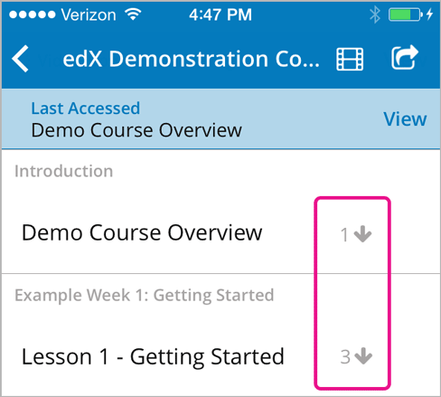

.. _SFD Mobile:

########################
The edX Mobile Apps
########################

The edX mobile apps are companions to the `edx.org`_ website. You can use the
apps to download course videos so that you can watch them whenever you want to,
even without an Internet connection. To access the rest of the course,
including homework and quizzes, you use a web browser on a computer.

There is an edX mobile app for Android smartphones and an app for iPhones.
For more information, check the answers to frequently asked questions in these
categories.

.. contents::
  :local:
  :depth: 1

.. _General Questions:

*************************
General Questions
*************************

================================
How do I get the mobile apps?
================================

The Android app is available in the `Google Play`_ Store. The iPhone app is
available in the Apple `App Store`_.

================================
How much do the apps cost?
================================

Both of the apps are free. You do not have to pay or buy anything to download or use them.

========================================
What platforms do the apps run on?
========================================

Right now, there are edX mobile apps for Android smartphones and for iPhones.
For the iPhone app, your device must be running iOS 7 or later.

We plan to make the app available on Android tablets and iPads in the
future.

================================================
How can I send questions or comments to edX?
================================================

EdX is glad to receive your input about the mobile apps. On the **My Courses**
page of your app, select the menu in the upper left corner, and then select
**Submit Feedback**.

.. _Getting Started:

*************************
Getting Started
*************************

======================================
Do I need an edX account?
======================================

You need to have an edX account before you can enroll in courses. You can sign
up for an edX account in the edX mobile apps, or use a web browser to go to the
`edx.org`_ website. When you create your account, you need to be connected to
the Internet.

======================================
How do I create an edX account?
======================================

When you open your edX mobile app, select **Sign up and start learning**. You
can create an edX account using your email address or your Facebook or Google
account. You also provide the following information.

* Your name.
* The username that will identify you to course teams and to other learners.
* A password.
* Your country or region. 

After you create your account, you can find courses that interest you and
enroll in them.

==================================================
How do I find courses to take?
==================================================

When you open the app and sign in to your edX account, you see a list of the
mobile-friendly courses that you are currently enrolled in. To find more
courses, at the end of this list select **Find a Mobile-Friendly Course**.

You can also use the menu at the top of the **My Course** page. Select **Find
Courses**.

   .. image:: ../../shared/students/Images/Mob_Menu.png
      :width: 300
      :alt: Mobile "My Courses" page with an arrow pointing to the menu in the
        upper left corner.

To sign up for a course, select **Enroll**.

Many of the edx.org courses are offered through the edX mobile apps. However,
we continue to work to make all edX courses mobile-friendly. We are adding more
mobile courses every week, so check back regularly to see new available
courses.

========================================
How do I unenroll from a course?
========================================

To unenroll from a course, use a web browser to go to the `edx.org`_ website.
You unenroll from courses on your :ref:`dashboard<SFD Learner Dashboard>`.

.. _Courseware Questions:

*************************
Courseware Questions
*************************

========================================================
Can I take a course entirely on my mobile device?
========================================================

Not at this time. With the edX mobile apps, you can download course videos to
watch when you do not have an Internet connection. To complete other work,
including readings, homework problems, and exams, use a web browser on a
computer.

========================================================
How do I post questions on the discussion board?
========================================================

.. The following paragraph describes the features of the edX mobile app for partners/edx.org
.. Alison, DOC-1840, June 2015

.. only:: Partners

  Right now, you cannot use the edX mobile apps to participate in course
  discussions. To read or contribute to the discussions, use a web browser on
  a computer.

.. The following paragraph describes the features of the edX mobile app for Open edX (adds notifications, assessments, discussions)
.. Alison, DOC-1840, June 2015

.. only:: Open_edX

  You can read and contribute to course discussions in the edX mobile apps
  whenever you have an Internet connection. After you select your course,
  select **Discussion**. You can then browse through different topics or search
  for words or phrases that interest you.

.. _Video Questions:

*************************
Video Questions
*************************

================================
How do I download videos?
================================

To download videos,  you must be connected to the Internet. Select the
"download" icon that appears to the right of each subsection or video
name.

* If you select download for a subsection, you download all of the
  videos in that subsection.
* If you select download for a video, you download only that video.

To download videos, you must be connected to the Internet. After you download
a video, you can watch it any time.

================================================
How much data will the videos in this app use?
================================================

Course videos are optimized for mobile playback, but watching or downloading
any video can result in heavy data use. We recommend using a Wi-Fi connection
if you intend to watch or download a lot of videos. The edX app has a
**Download only on Wi-Fi** setting that is enabled by default to help you avoid
using your cellular network accidentally.

========================================================================
What are the numbers to the right of the subsection names?
========================================================================

The number to the right of a subsection name indicates how many videos there
are in that subsection.

========================================
How can I make the video full screen?
========================================

Rotate your phone until the video changes to landscape mode, or select "full
screen" in the bottom right corner of the video player.

.. image:: ../../shared/students/Images/Mob_FullScreenIcon.png
   :width: 300
   :alt: Video with "full screen" icon circled.

==================================
How can I see captions?
==================================

While a video plays, select **Settings** (the "gear" icon) at the lower right,
and then select **Closed Captions**. If the video has captions, a list of
available languages appears. Select the language that you want from the list.

.. image:: ../../shared/students/Images/Mob_CCwithLanguages.png
   :width: 500
   :alt: Video with closed caption language menu visible.

Some courses have captions in only one language, while others offer several
language choices.

==================================
Can I speed up the videos?
==================================

You can change video speeds in the iPhone app. While a video plays, select
**Settings** (the "gear" icon) at the lower right, and then select **Video
Speed**.

In the Android app, videos currently run only in their original speeds. 

========================================
How do I change my download settings?
========================================

#. On the **My Courses** page, select the menu in the upper left corner.

   .. image:: ../../shared/students/Images/Mob_Menu.png
      :width: 300
      :alt: Mobile "My Courses" page with an arrow pointing to the menu in the
        upper left corner.

#. Select **My Settings**. 

#. Change the **Wi-Fi only download** setting.

.. note:: By default, the app is set so that it only downloads content, 
  including videos, if you are on a Wi-Fi network. If you change this setting, 
  you might exceed the data allowance for your cellular plan.

==================================
How do I delete downloaded videos?
==================================
 
#. On the **My Courses** page, select the menu in the upper left corner.

#. Select **My Videos**.

#. On the **All Videos** page, select the course that has the video that you
   want to delete. Alternatively, select **Recent Videos**.

#. At the bottom of the list of videos, select **Edit**. A "selection" icon
   appears next to each video name and at the top of the page.

#. Select the videos that you want to delete. To select all of the videos,
   select the icon at the top of the page.

#. Select **Delete**.

.. _Troubleshooting:

*************************
Troubleshooting
*************************

==========================================================================================
I see "This video is not available" when I try to watch a video. What can I do?
==========================================================================================

If you have problems viewing videos, make sure that you have an Internet
connection and then try to view or download the video again.

If problems persist, let us know. On the **My Courses** page, select the
"menu" icon, and then select **Submit Feedback**.

.. _Google Play: https://play.google.com/store/apps/details?id=org.edx.mobile
.. _App Store: https://itunes.apple.com/us/app/edx/id945480667?mt=8
.. _edx.org: https://edx.org