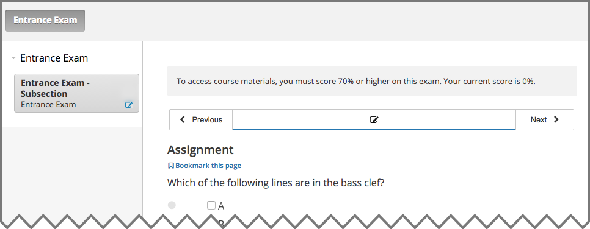

.. _SFD Prerequisites:

######################
Course Prerequisites
######################

Some edX courses require that you have a particular set of skills or knowledge
before you begin the course. Many courses include information about these
general requirements on their About page.

In addition to requiring general skills and knowledge, some courses require
students to pass a specific prerequisite edX course or pass an entrance exam.

.. _Prerequisite edX Course:

**************************
Prerequisite edX Course
**************************

When a course has a prerequisite edX course, you can see information about the
prerequisite course on the About page for the course that you want to take.

.. image:: ../../shared/students/Images/PrereqAboutPage.png
  :width: 500
  :alt: A course About page with prerequisite course information circled.

It is possible to enroll in the course even if you haven't taken the
prerequisite course. When you enroll in the course, the course appears on your
Student Dashboard. However, you cannot select the course to access the
course content. Below the name of the course, you can see the name of the
prerequisite course, as well as a link to that course.

.. image:: ../../shared/students/Images/Prereq_StudentDashboard.png
  :width: 500
  :alt: The Student Dashboard with an available course and a course that is
      unavailable because it has a prerequisite.

When you select the link, the About page for the prerequisite course opens.
You can then enroll in the prerequisite course.

After you successfully complete the prerequisite course, the other course
becomes available on your dashboard, just like other edX courses. You can then
select the course to access any available materials.

.. _Entrance Exam:

**************************
Entrance Exam
**************************

If you enroll in a course that requires an entrance exam, the course appears on
your Student Dashboard. However, you cannot access all released course content
immediately.

The first time that you access the course, the course opens to the **Entrance
Exam** page. At the top of the page, you can see a message that lists your
current score and the minimum score that is required to pass the entrance
exam. You can begin the exam immediately.

To take the exam, answer all the available questions, and then select **Check**
to submit your answers.

To see your score on the exam, refresh the page after you submit your answers.
The message at the top of the page tells you if you have passed the exam. If
you refresh the page before you answer all the questions in the exam, the
message tells you your current score.

After you pass the entrance exam, in addition to the message at the top
of the page, you can see all currently available course sections in the
left pane, and you can access all available course materials.

Instructors can allow students to skip the entrance exam. If your instructor
allows you to skip the entrance exam, you do not see the entrance exam when
you access the course.
