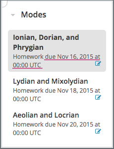
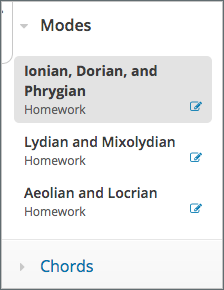

.. _SFD Course Pacing:

######################################################
Differences Between Instructor- and Self-Paced Courses
######################################################

Many courses are instructor-paced: they follow a schedule that the instructor
sets, with assignments and exams that have specific due dates. In contrast,
self-paced courses allow you to progress through the course at your own speed.

.. only:: Partners

    On the edx.org home page, an indication next to the course start date lets
    you know if a course is self-paced.

.. _SFD Instructor Paced:

*******************************
About Instructor-Paced Courses
*******************************

Instructor-paced courses follow a set schedule. The course team sets specific
due dates for assignments and exams, and you complete the course within a
defined time period, such as eight or twelve weeks.

Course materials become available at specific times as the course progresses.
Assignments have due dates, and exams have start and end dates. On the
**Course** page, indicators show when you have a graded assignment, as well as
the due date for the assignment.

     due dates visible for homework.

In most instructor-paced courses, certificates are generated within two weeks
of the end of the course.

For information about receiving certificates for an instructor-paced course,
see :ref:`SFD Receiving a Certificate`.

.. _SFD Self Paced:

*******************************
About Self-Paced Courses
*******************************

Self-paced courses do not follow a set schedule. Course materials are
completely available as soon as the course begins. Assignments and exams do
not have start or due dates. The course shows indicators for graded
assignments, but not due dates. You can complete assignments and exams at your
own pace, as long as you complete all course work before the course ends.

     homework due dates.

In most self-paced courses, the course team generates certificates on a
schedule, such as once a month. The certificate generation schedule varies by
course.

For information about receiving a certificate for a self-paced course, see
:ref:`SFD Receiving a Certificate`.
