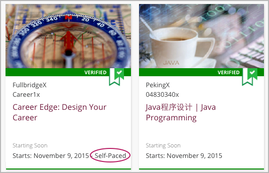

.. _SFD Self Paced:

##################
Self-Paced Courses
##################

Most edX courses are *instructor-paced*: they follow a schedule that the
instructor sets, with assignments and exams that have specific due dates. EdX
also offers a number of *self-paced* courses, which allow you to progress
through the course at your own speed.

On the edx.org home page, an indication next to the course start date lets you
know if a course is self-paced.

     catalog.

************************************************************
Differences between Instructor- and Self-Paced Courses
************************************************************

Instructor-paced courses follow a set schedule. Course materials become
available at specific times as the course progresses. Assignments have due
dates, and exams have start and end dates. During the course, indicators show
you when you have a homework assignment or exam, as well as the due date for
the assignment or exam.

.. image:: ../../shared/students/Images/Pacing_Inst.png
 :width: 200
 :alt: Part of the left pane in an instructor-paced course, with due dates
     visible for homework.

Self-paced courses do not follow a set schedule. All course materials are
available as soon as the course begins. Assignments and exams do not have start
or due dates. The course shows indicators for homework assignments, but not due
dates.

.. image:: ../../shared/students/Images/Pacing_Self.png
 :width: 200
 :alt: Part of the left pane in a self-paced course, with no homework due
     dates.

In self-paced courses, you can submit an assignment or exam at any time before
the course end date.
