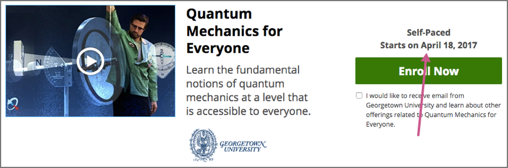
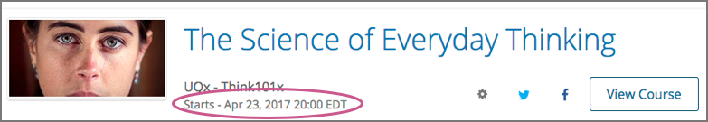

.. This file is used in both the edX and Open edX versions of the Learner's Guide. Some content is conditionalized.

.. _SFD Starting a Course:

********************
Starting a Course
********************

This section describes how to start a course and begin doing course work, and
how to change settings that apply to a specific course.

As soon as you enroll in a course, you can access some information about the
course and change course-specific settings on your :ref:`dashboard<SFD Learner
Dashboard>`. If the course start date has not passed, you cannot access course
lessons or assignments.

.. only:: Partners

  For more information, see :ref:`Course Availability` and :ref:`Differences
  Between Instructor- and Self-Paced Courses<SFD Course Pacing>`.

.. only:: Open_edX

  For information about availability of course content, see
  :ref:`course_content_availability`.

.. contents::
  :local:
  :depth: 1

.. _Start Date and Duration:

===========================
Find a Course's Start Date
===========================

You can usually enroll in a course before the start date, although you might
not be able to access course materials yet.

* You do not need to sign in exactly when the course begins.

* If the course content is not immediately available, you can set a calendar
  reminder for the course start date, and check back later.

You can find a course's start date on its About page. Not all courses publish
the exact start time.

If you have enrolled in a course, the course is added to the list of courses on
your :ref:`dashboard<SFD Learner Dashboard>`. You can find the start date on the
course listing on your dashboard.

     name of the course.

For more information about different course statuses, see :ref:`Course
Availability`

.. Deliberate omission of period at end of above sentence because the title that is inserted ends with a question mark.

===============
Start a Course
===============

To start work in a course, follow these steps on or after the course start
date.

.. Clarifying question on EDUCATOR-2190 2/7/18

#. On your dashboard, click **View Course** for the course that you want to
   open.

   .. image:: ../../shared/images/dashboard_view_course.png
     :width: 500
     :alt: A course card on the dashboard, with the View Course button circled.

   The course opens on the **Course** page, where you usually see a welcome
   message from the course team.

   .. image:: ../../shared/images/course_dismiss_update.png
     :width: 600
     :alt: The landing page of a course, with the Dismiss link in the welcome
        message circled, and the Updates link under Course Tools in the sidebar
        highlighted.

#. When you have read a message from the course team, you can click
   **Dismiss** to stop displaying the message. If you want to read the message
   again, click **Updates** under **Course Tools**.

   Below any messages from the course team, you see the course outline.

   .. image:: ../../shared/images/course_nav_outline.png
     :width: 350
     :alt: The course outline, with a section selected.

#. Click **Start Course** to go to the first section of the course, or select
   any part of the course to jump to it.

   If you have already accessed or worked in the course, you see a **Resume
   Course** button instead of a **Start Course** button. Click **Resume
   Course** to jump to the part of the course that you last completed.

==============================
View an Archived Course
==============================

You can enroll or continue to work in some courses even after the course end
date. These courses are archived, which means that while you can access the
course content, you cannot submit answers for graded problems or participate in
course discussions.

To view the content of an archived course, follow these steps.

#. On your dashboard, locate the course.

#. Select **View Archived Course**.

======================
View a Course Grade
======================

To view your current grade in a course that has not yet ended, see :ref:`SFD
Check Progress`.

To view your final grade in a course that you have completed, follow these
steps.

#. On your dashboard, locate the course. Your final grade appears under the
   course name.

#. Optionally, print your dashboard to obtain a record of your achievement in
   the course.

You can also view the course and open its **Progress** page to view your final
grade, as well as your grades on all course assignments.

========================
View Certificate Status
========================

If you are enrolled in a certificate track for your course, updates on the
status of your certificate, and options for accessing earned certificates, are
available in the course card on your dashboard.

For example, if you have earned a certificate and the course team has
generated certificates for the course, you can use the **View Certificate**
option to access your web certificate.

.. image:: ../../shared/students/Images/SFD_Cert_web.png
   :width: 600
   :alt: Dashboard with course name, grade, and link to the certificate.

.. only:: Partners

  For information about how to access certificates, including how to view,
  print, and share certificates, see :ref:`learners:Certificates`.

.. only:: Open_edX

  For information about how to access certificates, including how to view,
  print, and share certificates, see :ref:`openlearners:Certificates`.

