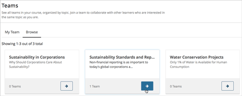
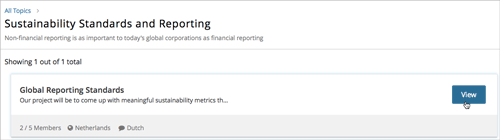
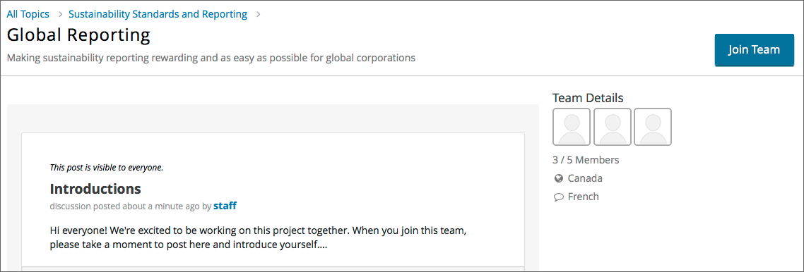
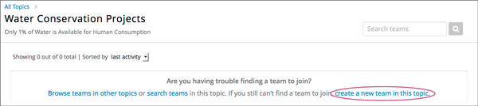
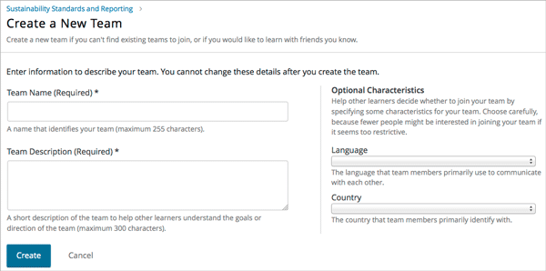

.. _SFD_Teams:

##########################################
Teamwork in Courses
##########################################

In courses that use teams, course staff create topics that you can choose from
for small group activities or projects. You choose a topic that interests you,
and form a team with other learners who have the same interest, to work on the
group activity or project together.

If your course includes teams, your instructor or course staff will provide
guidelines for how you should work in teams.

.. contents::
  :local:
  :depth: 2	

************************
About Teams and Topics
************************

If your course has topics that your course team has created for group work,
there is a **Teams** page in the LMS where you can see the list of topics and
their descriptions.

It is up to you to browse the topics and find one that you are interested in
working on. Then, you join a team that is working on that topic, either by
finding a team that has already been created, or by creating a new team
yourself. For more information, see :ref:`Browse Topics and Find a Team`.

Teams are always created within a specific topic, and have a maximum team size
that is decided by course staff.

.. _Browse Topics and Find a Team:

======================================
Browse Topics and Find a Team to Join
======================================

To browse topics and find a team to join, follow these steps.

#. In the LMS, select the **Teams** page.
#. Select the **Browse** tab.
#. On the **Browse** page, read about each of the available topics to work in.

#. When you have found a topic you are interested in, select the arrow button
   to see the teams that exist in that topic.

      that takes users to the list of teams within that topic highlighted.
      

5. Each team's name and description, and in some cases the optional primary
   language of a team and a country that team members identify with, are
   shown. 

   The number of team members is also shown, letting you know whether
   the team is full, or whether there is space for you to join.

6. To get a better sense of a team's members, discussion, and communications,
   select **View** for a team.

   On a team's detail page, you can browse the team's discussion posts, but
   you cannot participate unless you are a member of the team.

.. note:: You can navigate from a team's detail page back to the topic teams
   view or back to all topics using the breadcrumb links at the top of the
   page.

=======================
Join a Team
=======================

When you have found a team you want to join, select **Join Team**. 

.. note:: If a team is full, the **Join Team** button is not available.

.. image:: ../../shared/students/Images/Teams_JoinTeamButton.png
  :width: 500
  :alt: The Join Team button on the details page of a team.

Your profile is added to the list of team member profiles, and you can
participate in the team's discussions. The team that you joined is added to
the **My Team** page.

.. note:: You can only belong to one team at a time. If you belong to a team,
   but find another team that you want to join, you must leave the first team
   before you can join a new one.

.. Add back Invite Friends when this feature becomes available

=======================
Leaving a Team
=======================

If you have changed your mind about the team you joined, you can leave a team.

.. note:: edX recommends that you do not change teams after work in a course
   has started, without carefully considering the impacts to your work and
   that of your fellow learners. 

   If you must leave a team for some reason, make sure you communicate with
   your fellow team members and let them know why and when you are leaving.
   This is especially important if you are part of the way through your
   course, and you and your team have been working together on a project or
   activity.

To leave a team that you belong to, select **Leave Team** from the **Team
Details** page.

.. image:: ../../shared/students/Images/Teams_Leave Team.png
  :width: 200
  :alt: The Leave Team link on the Team Details page.

You are no longer visible in the team membership profiles list, or in the
membership count. You can no longer participate in the team's discussion.

.. Add info about confirmation message when implemented.

=======================
Creating a Team
=======================

Try to find an existing team to join, before creating a new team.

When you create a new team in a topic, you are automatically added as a
member.

To create a team, follow these steps.

#. From the **Teams** page in the LMS, navigate to the topic that you are
   interested in.

#. Select the arrow button to see the teams that exist in that topic.

#. At the bottom of the list of teams within the topic, click the **create a
   new team in this topic** link.

      showing all teams in a topic.

4. On the **Create New Team** page, add a name and description for the team. 

   In the description, include details about your proposed project or activity
   to help other learners to decide whether they want to join your team and
   work with you.

   You must include a team name and description, but you can choose whether to
   add some optional details for your team. If you want to, you can specify a
   language that members would primarily use to communicate with each other,
   and a country that members would primarily identify with. Keep in mind that
   if your team details make the team membership seem to selective, other
   learners might be discouraged from joining.

.. note:: Be careful in entering your team details. After you save the
   details for your new team, you cannot change them, and you cannot delete
   your team.

5. When you have finished adding your team details, click **Create**.

   Your new team is added to the list of team under your selected topic. You
   are automatically added as a team member.

..   For information about inviting friends to join a team, see :ref:`Inviting Friends to Join Your Team`.

********************************
About Discussions in Teams
********************************

After you join a team, you can participate in discussions on your team page
with other members.

================================
Making Posts in Team Discussions
================================

Although you can view discussions in a team before joining it, you must belong
to a team to add new posts to the team's discussion forum.

Team discussions work in the same way as your course discussions. For
information about course discussions, see :ref:`Anatomy of edX Course
Discussions`.

