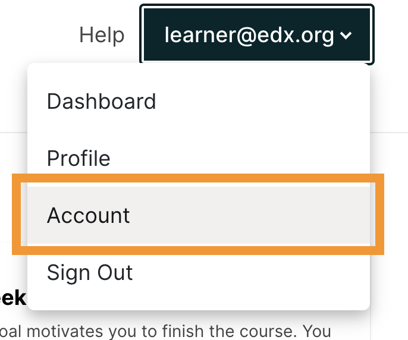

.. This topic is used in both the edX and Open edX versions of the Learner's Guide

.. _SFD Update Account Settings:

##################################
Updating Your Account Information
##################################

After you create an account, you can find and update information about your
account on the account settings page.

.. contents::
 :local:
 :depth: 1

********************
Account Settings
********************

You access your account settings page by selecting the dropdown menu icon next
to your username at the top of any site page.

     dropdown icon next to your username. The Account option is circled, and
     the other options are Dashboard, Profile, and Sign Out.

The account settings page presents information in these categories.

* **Account Settings** provides access to information about your account.

* **Linked Accounts** lists social media and other accounts that you can
  connect to your account.

* **Order History** lists information about payments you have made, such as
  fees for verified certificates. For more information, see
  :ref:`View Order History`.

.. _SFD Basic Information:

********************
Change Your Password
********************

To change your password, follow these steps.

#. At the top of any page, select the dropdown menu icon next to your username.

#. Select **Account**.

#. Select **Reset Password**.

   The system sends a confirmation message to the email address in the **Email
   Address** field.

#. Select the confirmation link in the email message.

*************************
Update Your Email Address
*************************

You use your email address to sign in to your account. In addition,
communications from your course teams are sent to this address.

To update your email address, follow these steps.

#. At the top of any page, select the dropdown menu icon next to your
   username.

#. Select **Account**.

#. In the **Email Address** field, select your current email address and
   replace it with the new address.

#. To save your changes, click anywhere on the page outside of the **Email
   Address** field, or navigate to a different page.

*************************
Change Your Full Name
*************************

Your full name appears on the certificates that you earn. Other learners
see only your username. They do not see your full name.

.. note:: You can change your full name, but you cannot change your username.

.. only:: Partners

  When you :ref:`verify your identity<SFD Verify Your Identity>`, the name on
  your government-issued ID must match the full name for your account.

To change your full name, follow these steps.

#. At the top of any page, select the dropdown menu icon next to your
   username.

#. Select **Account**.

#. In the **Full Name** field, make the revisions that you require.

#. To save your changes, click anywhere on the page outside of the **Full
   Name** field, or navigate to a different page.

*************************
Select a Language
*************************

You can specify the language that you want the site to use during your
visits.

.. note:: This setting changes the appearance of menu options, button labels,
  and other elements of the site's user interface. It does not apply to course
  content.

To select a language, follow these steps.

#. At the top of any page, select the dropdown menu icon next to your
   username.

#. Select **Account**.

#. Select a **Language**. The site saves your selection immediately.

   The website is currently available in a limited number of languages.

*********************************
Select Your Time Zone or Location
*********************************

You can select the time zone that you want course dates and times to appear
in, and update the country or region where you live.

.. note::
  If you do not select a time zone, course dates and times in the body of the
  course, on your **Progress** page, and on your dashboard display in the time
  zone that your browser settings specify. Other dates and times display in
  Coordinated Universal Time (UTC). Dates and times that use your browser time
  zone are in military time and are followed by a time zone indicator: for
  example, 17:00 Sept 16, 2018 IOT. Dates and times in UTC do not have a time
  zone indicator.

To select your time zone or location, follow these steps.

#. At the top of any page, select the dropdown menu icon next to your
   username.

#. Select **Account**.

#. Select a **Time Zone**. The site saves your selection immediately.

#. Select a **Country or Region**. The site saves your selection
   immediately.

.. _SFD Additional Info:

*********************************
Specify Additional Information
*********************************

Additional account information is optional and includes the following
information.

* **Education Completed**: The highest level of education that you have
  completed.
* **Gender**: The gender you identify as.

* **Year of Birth**: The year that you were born.

* **Preferred Language**: The language that you prefer to communicate in.

To view or change this information, follow these steps.

#. At the top of any page, select the dropdown menu icon next to your
   username.

#. On the **Account Settings** page, select **Account Information**.

#. On the **Account Information** page, locate the **Additional Information**
   section, and then make your changes.

The site saves your changes automatically.

.. _Link Accounts:

***************************************
Link or Unlink a Social Media Account
***************************************

You can link your edX or edX Edge account to social media and other accounts,
including Facebook, Google, and school or company accounts.

.. note:: If you link your accounts, whenever you sign in to the social media
   or other account, you also sign in to your edX or edX Edge account
   automatically.

To link your account with another account, follow these steps.

#. At the top of any page, select the dropdown menu icon next to your
   username.

#. Select **Account**.

#. On the **Account Settings** page, select **Linked Accounts**.

#. On the **Linked Accounts** page, select **Link Your Account** under the
   name of the account that you want to link to your account.

   To unlink your account from a social media account, select **Unlink This
   Account** under that account name.

