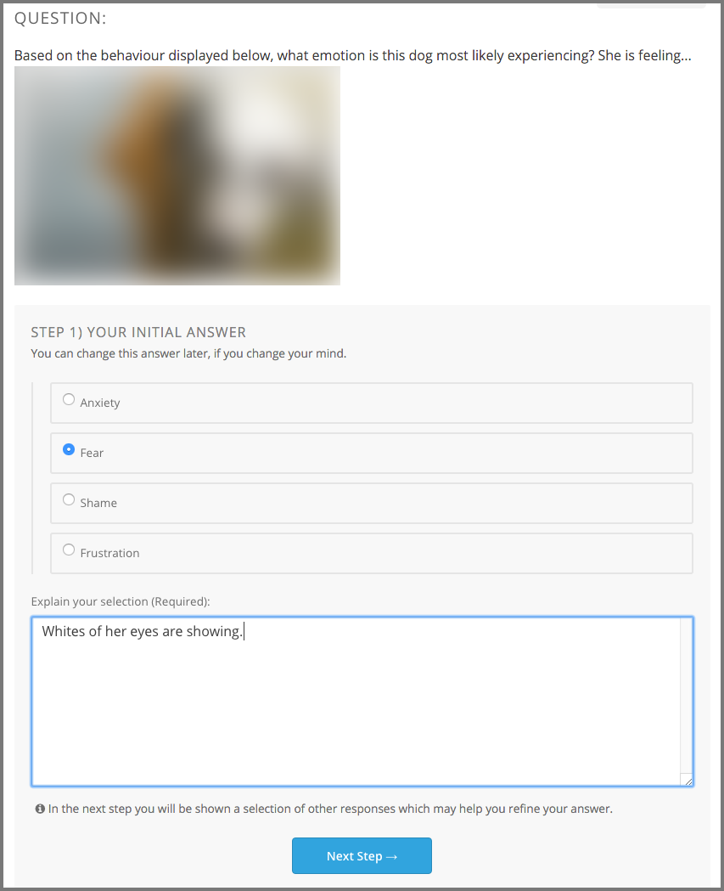
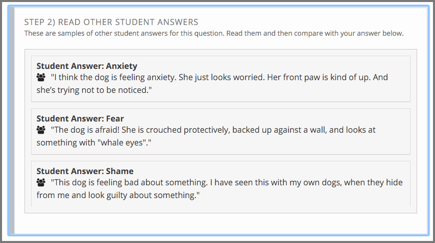
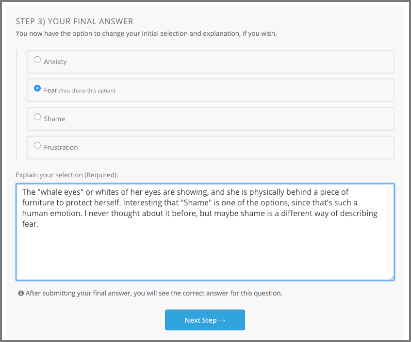
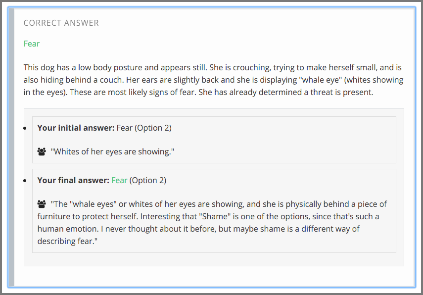
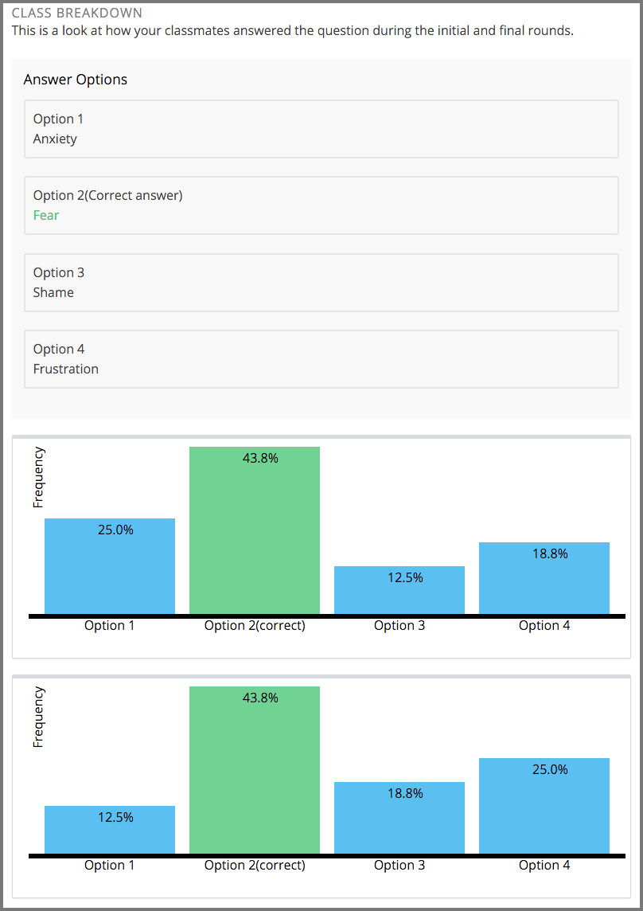

.. _interactive_multiple_choice:

###################################
Explaining Multiple Choice Answers
###################################

If you encounter a multiple choice question that is followed by a field for an
explanation, there are actually several more steps that you need to complete
for the assignment. These assignments involve sharing what you have learned
with other people in your online course. They give you an opportunity to learn
from each other.

In a classroom setting, this type of assignment is sometimes called a "peer
instruction" or "clicker" question.

This section describes how you complete these interactive assignments.

.. contents::
 :local:
 :depth: 2

*******************
Assignment Overview
*******************

When a multiple choice question also requires an explanation, the next step in
the assignment is to share your rationale for your answer with other learners,
and to see the choices and explanation that other learners shared.

Names are not shown with the responses. As a result, you can focus on
contributing the best answer possible, without worrying about whether your
reasoning, or your spelling, is exactly correct.

Then, you get to apply what you learned from the others: you have another
chance to answer the question.

******************************************
Completing the Assignment
******************************************

In this type of assignment, you see a multiple choice question. After you
select an answer you complete these steps.

============================
Step 1. Explain Your Choice
============================

Write an explanation for why you chose your answer.

This step is your opportunity to provide a persuasive argument about why your
answer is the correct one. You might include references to a course video or
textbook, or describe how you arrived at the choice you made.

Together, the answer that you chose and this explanation are your initial
response. When you select **Next**, your initial response is added to the
collection of initial responses by all of the other course participants.

   that choice.

======================================
Step 2. Review Other Initial Responses
======================================

Review the initial responses that other participants in the course submitted.
The course team decides how many you see. You might see one response for each
of the possible answer choices, or a set that is chosen completely at random.

This step gives you a chance to learn from the explanations that other learners
submitted, and reassess your own understanding of the topic.

Because they are part of the collection of initial responses, your answer and
explanation are likely to be shown to other learners when they get to this part
of the assignment.

============================
Step 3. Revise Your Response
============================

Decide whether you want to change your initial response by selecting a
different answer choice, revising your explanation, or both.

This step is optional. You can submit a final response that is the same as your
initial response, or change it completely. When you select **Next Step**, you
learn the correct answer.

=================================
Step 4. Review the Correct Answer
=================================

Review the correct answer choice and the explanation provided by the course
team.

==========================
Step 5. Compare Answers
==========================

Use the graphs to compare the percentage of your fellow learners who selected
each answer. The first graph shows the percentage of learners who selected each
answer initially, and the second graph shows the percentage of learners who
selected each answer after they had the opportunity to review the explantions
that other learners provided. Compare your own choices, and the correct one, to
your peers'.

This step might be just as thought provoking as the other steps.

     for their initial response and their final response.

.. note:: The graphs appear after 10 learners submit their final responses.
 If the graphs do not appear, give the others taking the course some time, and
 then refresh your browser page.
