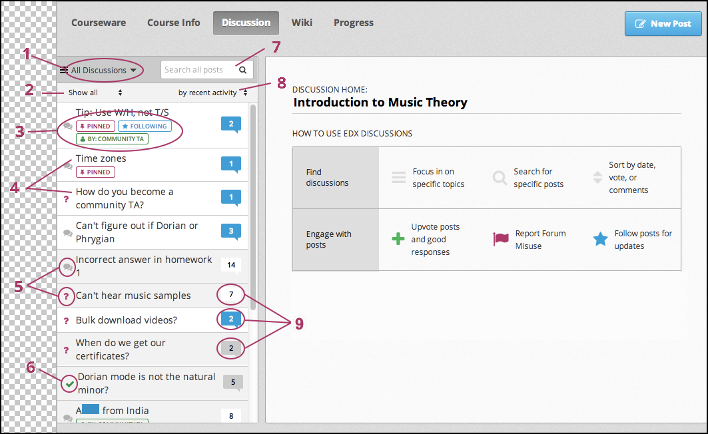

.. _Anatomy of edX Course Discussions:

#######################################
Anatomy of edX Course Discussions
#######################################

This topic describes how course discussions are organized in an edX course.

.. contents::
  :local:
  :depth: 1

**********************************************
Basic Elements: Posts, Responses, and Comments
**********************************************

Discussions are made up of *posts*, *responses*, and *comments*. Together,
posts, responses, and comments are known as *contributions*, and a post
together with its responses and comments is an *exchange*.

* Posts initiate a conversation by asking a question or making a statement
  for learners to consider.

* Responses reply directly to the post.

* Comments, in turn, reply to specific responses.

The following conversation shows each of these contributions:

::

  Post: "Please introduce yourself."
    - Response: "My name is Lee and I teach secondary school maths in Canberra,
      Australia."
    - Response: "Hello everyone, I am Sumei from Hong Kong, China."
      - Comment: "Hi Sumei, I am taking this course in Hong Kong too. Maybe we
        should make a study group!"
      - Comment: "I'd like to join the Hong Kong study group too, I think it
        will help me keep up with the homework."
    - Response: "Hi from Johannesburg! I am taking the course to prepare for my
      matric exams."

You can see posts, comments, and responses, as well as other information about
the course discussions and individual posts, on the **Discussion** page.

********************
The Discussion Page
********************

When you go to the **Discussion** page in your course, you see a page that
looks like the following image. You can select the image to enlarge it.

       of the "How to use edX discussions" pane. Numbered callouts indicate the
       elements on this page.

===========================
Discussion Navigation Pane
===========================

The discussion navigation pane shows titles and information for all the
individual posts in the course. The discussion navigation pane also has filters
that you can use to sort discussions by topic, status, and activity.

The discussion navigation pane includes the following elements.

#. The drop-down discussion list. When you select this list, you can see all of
   the topics in the course discussions, or you can view only the posts that
   you are following. For more information about discussion topics, see
   :ref:`Discussion Topics`. For more information about following posts, see
   :ref:`Follow Posts`.

#. The status filter. You can filter discussions that you have not read yet, or
   that contain unanswered questions. For more information, see :ref:`Answer
   Questions`.

#. Specific identifiers. If a moderator has pinned a post so that it is at the
   top of the list, if you chose to follow a post, or if the person who created
   the post is a community TA, moderator, or administrator, you see a colored
   identifier with this information.

#. The title of the post. The title lets you know what the post is about.

#. The post type icon. A post can be a discussion or a question. For more
   information, see :ref:`Determine Post Type`.

#. An icon that indicates a "correct answer". The green check mark icon
   indicates that one of the responses to the post correctly answers the
   question that the post asks.

#. The post search box. You can search all posts, responses, and comments for
   individual words or phrases. For more information, see :ref:`Search
   Discussions`.

#. The activity sorting control. You can sort listed posts by recent activity,
   most activity, or most votes. For more information, see :ref:`Keep Up with
   New Activity`.

#. Status indicator icons. These indicators show whether you have read a post
   and the number of responses and comments for that post. For more
   information, see :ref:`Keep Up with New Activity`.

===========================
How to Use edX Discussions
===========================

When you select the **Discussion** page, information about how to use edX
discussions appears with information about how you can interact with posts.
Each of these interactions is covered later in this topic. For more
information, see the following sections.

* :ref:`Explore Posts`
* :ref:`Follow Posts`
* :ref:`Provide Feedback`

On this page, you can also specify that you want to receive an email message
each day that summarizes discussion activity for the posts you are following.
To receive this daily digest, select **Receive updates**.

.. image:: ../../../shared/students/Images/Disc_ReceiveUpdates.png
  :width: 400
  :alt: The How to Use edX Discussions pane with the Receive Updates check box
      circled.

After you select the title of a post, this area of the page shows the post,
responses to the post, and comments on responses. The page is formatted to help
you distinguish posts, responses, and comments.

* The post and its title appear at the top of the page.

* Responses appear indented and with a white background below the original
  post.

* Comments on a response appear with a gray background below the response. The
  font size for comments is smaller than the font size for responses.

These elements appear in the image below. You can select the image to enlarge
it.

.. image:: ../../../shared/students/Images/Disc_PostsEtc.png
   :width: 600
   :alt: Discussion page with a specific post selected in the discussion
       navigation pane and the post, responses, and comments next to it.

Additionally, there are several option icons available for every post,
response, and comment. The option icons that appear depend on the type of
contribution. (For more information, see :ref:`Provide Feedback`.)

.. image:: ../../../shared/students/Images/Disc_OptionIcons.png
  :width: 450
  :alt: A single post with the option icons indicated.

The icons that you see might include the following options.

* A plus sign (+), together with the number of votes the post has received.
  Select this icon to vote for the post or response. For more information, see
  :ref:`Vote for Posts or Responses`.

* A star (posts only). Select this icon if you want to follow the post. For
  more information, see :ref:`Follow Posts`.

* A check mark (responses only). For questions, the student who posted the
  question, or discussion team member, can use this icon to indicate that the
  response is correct. For more information, see :ref:`Answer Questions`.

* An ellipsis, or "more", icon (...). When you select this icon, you may see
  several additional options:

  * **Edit**. This option is only visible if you are the author of the post,
    response, or comment. You can change the text of your contribution, or, for
    posts, you can change the type of post. For more information, see
    :ref:`Edit or Delete`.

  * **Delete**. This option is only visible if you are the author of the post,
    response, or comment. For more information, see :ref:`Edit or Delete`.

  * **Report**. You can use this option to report an inappropriate post,
    response, or comment. For more information, see :ref:`Report Discussion
    Misuse`.
