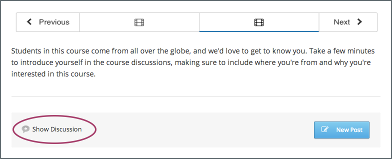

.. _Explore Posts:

###########################
Exploring Discussion Posts
###########################

This topic describes how to explore discussion posts in your edX course.

.. contents::
  :local:
  :depth: 1

*********
Overview
*********

Finding out whether someone else has already asked the same question or
initiated a conversation about the subject that interests you, and then
reading and contributing to that exchange instead of starting a new one, helps
make the time that everyone spends with the course discussions more productive.
You can search for something specific, or you can browse through the posts in a
single discussion topic.

.. _Search Discussions:

******************************
Search the Discussions
******************************

To search for text, select **All Discussions** and enter a phrase, a word, or
part of a word in the **Search all posts** field in the discussion navigation
pane. When you press Enter, the search tries to find:

* A match or close match to your text in any post, response, or comment. The
  display updates to show a list of the posts that have a match at any level of
  interaction.

* A similar value in any post, response, or comment (if no exact matches are
  found). A "No results found for {text}. Showing results for {similar}"
  message appears above the posts that have similar text at any interaction
  level.

* Any usernames that are an exact match to your text. A "Show posts by
  {username}" option appears above any posts that have an exact text match at
  any interaction level. Select the username in the message to read that user's
  posts, responses, and comments. For more information about viewing
  contributions from a specific user, see :ref:`View from Participant`.

.. _Discussion Topics:

*********************************************
View Discussions about a Specific Topic
*********************************************

Every post in the course discussions has an associated topic. When a
participant creates a post, the participant selects a topic from a list of
topics that the course team has provided. You can look through topics in the
discussions to find one that interests you.

Discussion topics for edX courses can be *course-wide* or *content-specific*.

* Course-wide discussion topics cover matters that affect the entire course,
  and can include topics such as "Frequently Asked Questions" and
  "Troubleshooting".

* Content-specific discussion topics cover specific video lectures, reading
  assignments, homework problems, or other course content.

=======================================
View Topics on the Discussion Page
=======================================

On the **Discussion** page, you can view both course-wide and content-specific
discussions. Select **All Discussions** in the discussion navigation pane to see all of the discussion topics in the course. To see all of the posts in
an individual topic, select the topic name.

Note that course-wide topics do not have other topics indented below them,
while content-specific topics are indented under a category name. For
content-specific topics, you can select either the category name to see all
of the posts in that category, or you can select an individual topic name.

.. image:: ../../../shared/students/Images/Disc_TopicList.png
  :width: 400
  :alt: Discussion topic list expanded, showing all course discussion
         topics.

=======================================
View Topics in a Course Unit
=======================================

Content-specific topics are located in specific units in the course. They
typically appear below the content they apply to.

You can access a content-specific topic by viewing the unit that
contains the topic. To see the discussion, select **Show Discussion**.

       identified by a "Show Discussion" link.

You can also use the **Discussion** page to access a discussion in the unit
where that topic is located.

#. In the list of topics, select the topic that you want.

#. Select a post title to open the complete post and its responses and comments
   next to the above the discussion navigation pane.

#. In the text of a post, select the name of the discussion topic to go to the
   discussion inside the unit.

.. image:: ../../../shared/students/Images/Disc_LinkToCourse.png
    :width: 800
    :alt: Post on the Discussion page with a link back to the course unit.

*****************************************
View Only Unread or Unanswered Posts
*****************************************

To limit the posts shown on the **Discussion** page, you can select one of the
filter options. The **Show all** filter in the discussion navigation pane is
selected by default.

* To list only the discussions and questions that you have not yet viewed,
  select **Unread**.

* To list only question posts that do not yet have any responses marked as
  answers, select **Unanswered**.

.. image:: ../../../shared/students/Images/Disc_Unread.png
 :width: 300
 :alt: List of unread topics with the "Unread" filter circled.

*****************************************
View Pinned Posts
*****************************************

Pinned posts appear at the top of the list of posts in the discussion
navigation pane when you view all discussions. Pinned posts can contain
important information about the course or any part of the course, such as a
particular video or problem. The pinned post can originate from anyone in the
course, including other learners or members of the discussion moderation team,
but only members of the moderation team can pin a post.

.. image:: ../../../shared/students/Images/Disc_Pinned.png
 :width: 300
 :alt: Short list of posts with the "pinned" identifier circled.

.. _View from Participant:

*************************************************
View Contributions from a Specific Participant
*************************************************

You can review all the posts, responses, and comments that a specific
participant has made. You can select other learners, or members of the course
team. To do this, select the username that appears at the top of any of the
participant's contributions. A page opens that shows the following information
about the participant.

* The participant's username.

* The participant's role (for example, student or community TA).

* The number of posts the participant has created (listed in the upper-left
  corner as the number of discussions started).

* The total number of responses and comments the participant has added to other
  posts (listed in the upper-left corner as the number of comments).

* A list of all the posts that contain a contribution from the participant,
  whether the participant created the original post or contributed a response
  or comment to a different post. The list of posts in the discussion
  navigation pane includes the title of the post and the username of the
  participant who created the post. To see the comments or responses on any
  post, select **View Discussion** below the post to open the discussion on the
  **Discussion** page.

.. image:: ../../../shared/students/Images/Disc_UserContributions.png
 :width: 800
 :alt: Page that lists the posts that a user has added or contributed to.

.. include:: ../../../links/links.rst
