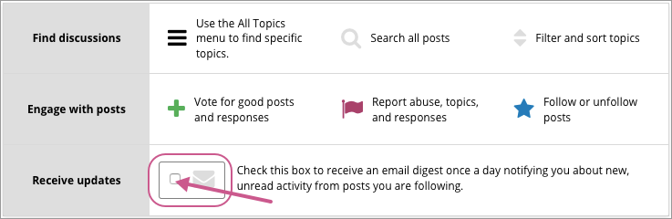

.. _Keep Up with New Activity:

################################
Keeping Up with New Activity
################################

This topic describes how to keep up with discussion activity in your edX
course.

.. contents::
  :local:
  :depth: 1

.. _Read New or Updated Posts:

****************************
Reading New or Updated Posts
****************************

The list of posts in the discussion navigation pane on the **Discussion** page
provides visual cues to help you distinguish posts that are new, or that have
responses or comments that you have not read yet, from exchanges that you have
already read completely. For information about the labels and icons used in
posts, see :ref:`Discussion Navigation Pane`.

====================
Sorting by Activity
====================

In the discussion navigation pane you can sort posts by activity. To do this,
select the drop-down list of sorting options at the top of the discussion
navigation pane and select either **by recent activity** or **by most
activity**.

Sorting by recent activity changes the order of the posts so that the post that
was most recently updated appears at the top of the list. Updating includes
having responses or comments added.

Sorting by most activity changes the order of the posts so that posts with the
most responses or comments appear at the top of the list.

==================
Sorting by Votes
==================

In the discussion navigation pane you can sort posts by the number of votes
received. To do this, select the drop-down list of sorting options at the top of
the discussion navigation pane, and select **by most votes**.

Sorting by the most votes changes the order of the posts so that posts that
have received the most votes appear at the top of the list. In this view,
instead of the response and comments count indicator, the number of votes that
each post has received is shown. Votes for responses are not included in the
number.

For more information about voting for posts, see :ref:`Vote for Posts or
Responses`.

****************************
Receiving Daily Digests
****************************

You have the option to receive an email message each day that summarizes
discussion activity for the posts you are following. To receive this daily
digest, select **Discussion** to go to the discussions home page, and then
select the **Receive updates** check box in the **How to use edX discussions**
graphic.

