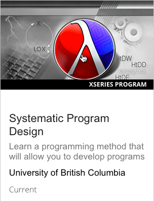

.. _SFD Enrolling in a Course:

#################################
Enrolling in a Course or Program
#################################

This topic describes how to enroll in an edX course or program, select or
change your enrollment track, and verify your identity in an edX course.

.. contents::
  :local:
  :depth: 1

********************
Courses and Programs
********************

EdX offers both individual courses and groups of related courses, called
programs.

=======
Courses
=======

To learn about a course, view the About page for that course by selecting the
course in the edX course list. The About page lists important information about
the course, including a course description, the institution that offers the
course, the hours of work that you should expect to spend on the course each
week, and the enrollment tracks that the course offers.

Enrollment Tracks
*********************

When you enroll in an edX course, you enroll in one of the following enrollment
tracks, depending on whether you want to earn a verified certificate for your
course.

* The audit track does not offer certificates.
* The verified track offers verified certificates to learners who verify their
  identities and pass the course.

Audit Track
============

Most courses offer an audit track. The audit track does not include a
certificate when you complete your course. The audit track is free of charge,
and includes access to all course materials, including assignments and exams.
You are automatically enrolled in the audit track when you enroll in a course.

After you enroll in the audit track, if the course offers a verified track and
the deadline for enrolling in the verified track has not passed, you can
upgrade to the verified track. For more information, see :ref:`SFD Change to
the Verified Track`.

.. _SFD Verified Track:

Verified Track
==============

Many courses offer a verified track in addition to the audit track. The
verified track awards verified certificates to learners who successfully
complete the course and verify their identities by using a webcam and a
government-issued photo ID.

When you enroll in the verified track, you must pay a fee that varies by
course. The fee helps support edX's mission. The fee for the course is listed
on the About page for that course. If you are unable to pay the course fee, you
can apply for financial assistance using the `financial assistance
application`_.

.. note::
  When you enroll in the verified track, you must submit your payment before
  you can see course content. You do not have to verify your identity at that
  time. However, you must verify your identity before the deadline for
  verification in that course. For more information, see :ref:`SFD Verify Your
  Identity`.

If a course has a verified track, you see a "Verified" indication on the course
image in the course catalog on edx.org.

.. image:: ../../shared/students/Images/SFD_VerifiedBadge.png
   :width: 200
   :alt: Image of the DemoX course card with a verified indication.

For more information about enrolling in the verified track for a course, see
:ref:`SFD Enroll in a Course` or :ref:`SFD Change to the Verified Track`.

For a list of all courses that currently offer verified certificates, see the
`edX course catalog`_.

For more information about verified certificates, see `Verified Certificates`_
on edx.org.

========
Programs
========

In addition to taking individual edX courses, you can enroll in an XSeries
program. An XSeries program is a group of courses that explore a specific
subject in depth. An XSeries program offers an XSeries certificate after you
earn a verified certificate for all of the courses in the program. All courses
in an XSeries program offer verified certificates.

XSeries programs have an "XSeries program" indication in the course catalog on
edx.org. To learn more about the program and its courses, select the program.

       indicator.

To complete an XSeries program, you must earn a verified certificate in each of
the courses in the program.

For more information about XSeries programs, see `XSeries Programs`_ on
edx.org.

For a list of all XSeries programs, see the `edX course catalog`_.

********************************
Enrolling in a Course or Program
********************************

After you decide that you want to complete a course or program, you enroll in
that course or program.

.. _SFD Enroll in a Course:

==================
Enroll in a Course
==================

To enroll in a course, follow these steps.

#. In the `edX course catalog`_, select the course that you want to take.

#. When the About page for the course opens, select **Enroll Now**.

   * If the course offers only an audit track, you are enrolled in the course
     after you select **Enroll Now**.

   * If the course offers a verified track in addition to the audit track, and
     you want to earn a verified certificate, you can upgrade to the verified
     track after you select **Enroll Now**.

     To upgrade to the verified track, select **Pursue a Verified
     Certificate**, and then follow the instructions to pay the course fee and
     verify your identity. You must pay the course fee before you can begin
     the course. You do not have to verify your identity immediately, but you
     must verify your identity before the course ID verification deadline has
     passed. For more information, see :ref:`SFD Verify Your Identity`.

     For more information about the verified track, see :ref:`SFD Verified
     Track`. For more information about verified certificates, see `Verified
     Certificates`_.

     After you submit a payment for the verified track, you can view that
     payment at any time. For more information, see :ref:`View Order History`.

#. After you enroll in the course, on the website, your dashboard opens with
   the new course added to your list of courses. In the mobile app, the new
   course opens.

On the website, select **View Course** on your dashboard to open the **Home**
page for the course. If the course has already started, you can select the
**Course** page to access released course materials.

.. note:: Course instructors occasionally enroll learners directly in a
 course. If this is the case, you receive an email that contains a link to the
 course. Select the link to enroll in the course.

===================
Enroll in a Program
===================

To enroll in a program, enroll in any course that is part of that program. You
do not need to complete any additional steps.

After you enroll in a course, the XSeries program is listed on the **Programs**
page on your learner dashboard. You can select the card for the XSeries program
to go to a page that has more information about the program. On this page, you
can view your progress through the program, enroll in more of the program's
courses, and view any certificates that you have earned.

******************************
Changing Your Enrollment Track
******************************

You might enroll in the audit track for a course, but then decide that you want
to earn a verified certificate. Or you might enroll in the verified track for a
course, but then decide that you want to audit the course instead. If the
course has recently started, you might be able to change your course track.

.. note:: Currently you can only upgrade to the verified track for courses on
   the edx.org website.

.. _SFD Change to the Verified Track:

=============================
Upgrade to the Verified Track
=============================

You can upgrade to the verified track until enrollment for verified
certificates ends for your course, usually two or more weeks after the course
starts.

To upgrade to the verified track, go to your dashboard, and then select
**Upgrade to Verified Track** under the name of your course. You then follow
the instructions to upgrade your enrollment track.

If the **Upgrade to Verified Track** option does not exist, the enrollment
deadline for the verified track has passed.

You must pay the course fee to enroll in the verified track. If you are unable
to pay the course fee, you can apply for financial assistance using the
`financial assistance application`_. You must apply for financial assistance
before the deadline to enroll in the verified track has passed.

After you submit a payment for the verified track, you can view that payment at
any time. For more information, see :ref:`View Order History`.

If you have a question or an issue with your payment, contact edX at
billing@edx.org. Include your order number, but **do not include your
credit card information**.

If you have questions about changing your enrollment track, contact the edX
support team at technical@edx.org.

==============================================
Change to the Audit Track and Receive a Refund
==============================================

.. important::
  To receive a refund, you must change your enrollment to the audit track
  before verified track enrollment closes for your course.

To change from the verified track to the audit track, go to your dashboard, and
then select **Unenroll** under the name of your course. The edX support team
will contact you with information about a refund.

If you do not see an **Unenroll** option, enrollment for the verified track has
closed. Enrollment for the verified track typically closes two weeks after the
course has started, or after at least one assignment due date has passed.

If you have questions about changing your enrollment track, contact the edX
support team at technical@edx.org.

.. _SFD Verify Your Identity:

******************************
Verifying Your Identity
******************************

.. important::

  You must use a webcam and a government-issued photo ID to verify your
  identity. If you do not have a webcam, edX recommends that you find out if
  your local library has a webcam that you can use, or that you borrow a
  friend's webcam. If you have a smartphone that has a camera, you can also
  verify your identity by visiting the following page in the smartphone's
  browser.

  https://courses.edx.org/verify_student/reverify

  If you do not use a webcam to verify your identity, you cannot receive a
  verified certificate.

When you enroll in the verified track for a course, you do not have to verify
your identity immediately, but you must verify your identity before the course
ID verification deadline. The deadline appears below the name of the course on
your dashboard.

To verify your identity, you use a webcam to submit a photo of yourself and of
a government-issued photo ID to edX's authorization service. We encrypt your
photos and use the highest levels of security available to protect your data.

.. note::

  When you verify your identity for one course, you verify your identity for
  all edX courses. Verification is effective for one year. If you enroll in
  another verified course within that year, you do not have to verify your
  identity again.

  If you enroll in a course that offers academic credit, you might have to
  verify your identity periodically during the course. For more information,
  see :ref:`SFD Academic Course Credit`.

To verify your identity, follow these steps.

#. Make sure that you have a webcam and a government-issued photo ID available.

   If you do not have a webcam, your local library might have a webcam, or you
   might be able to borrow a webcam from a friend. If you have a smartphone
   that has a camera, you can also verify your identity by visiting the
   following page in the smartphone's browser.

   https://courses.edx.org/verify_student/reverify

#. Start the verification process by completing one of the following actions.

   * If you have not yet enrolled in the course, select **Pursue a Verified
     Certificate**, submit payment information, and then select **Verify Now**
     on the payment confirmation page.

   * If you enrolled in the audit track of the course, select **Upgrade to
     Verified Track** next to the course on your dashboard.

   * If you enrolled in the verified track and submitted payment but you have
     not yet verified your identity, select **Verify Now** next to the course
     on your dashboard.

#. On the **Take Your Photo** page, select the camera icon below your image to
   take a picture of your face.

   For information about how to take a good photo, review the **To take a
   successful photo** guidelines to the right of your image.

#. Review your photo. If you are not satisfied with the photo, select **Retake
   Photo**. When you are satisfied with your photo, select **Next: Take a
   photo of your ID** in the lower right corner.

#. On the **Take a Photo of Your ID** page, hold your government-issued photo
   ID up to the webcam on your computer. Make sure the ID in the image is
   legible, and then select the camera icon below the image box to take a
   photo of your ID.

#. Review your photo. If you are not satisfied with the photo, select **Retake
   Photo**. When you are satisfied with your photo, select **Next: Review Your
   Info** in the lower right corner.

#. On the **Review Your Photos** page, review the photos of your face and of
   your ID. Make sure that the photos meet the requirements listed under
   **Photo requirements**, and then select **Confirm** in the lower right
   corner.

   .. important:: If your ID uses non-Roman characters, you must edit your edX
    account name in this step to use non-Roman characters so that your edX
    account name exactly matches the name on your ID. To do this, select
    **Edit Your Name** in the list of requirements, and then enter your name
    in non-Roman characters in the text box.

     .. image:: ../../shared/students/Images/SFD_VerifyID_NonRoman.png
      :width: 500
      :alt: The Review Your Photos page with a photo of an ID with non-Roman
        characters and a callout indicating where the learner enters his full
        name.

A verification confirmation page opens and confirms that you have submitted
your ID verification photos.

After edX's authorization service examines your photo, you receive a message
on your dashboard that informs you whether the verification process was
successful. If the verification process was not successful, you must submit
new verification photos. You can begin the verification process again by
selecting **Verify Your Identity**.

.. include:: ../../links/links.rst
