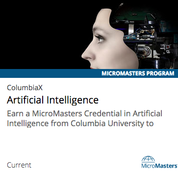

.. This file is for edX only; not included in Open edX version of the Learner's
.. Guide.

.. _SFD Enrolling in a Course:

####################################
Enrolling in edX Courses or Programs
####################################

This topic provides information about edX courses and programs, and how to
enroll.

.. contents::
  :local:
  :depth: 1

For information about the types of certificates that are available and accessing
the certificates you earned, see :ref:`Certificates`.

For information about how to enroll in a certificate track for a course and how
to verify your identity for certificates, see :ref:`SFD Pursuing Certificate`.

*******************************
About edX Courses and Programs
*******************************

EdX offers both individual courses and groups of related courses, called
programs.

To learn about a course or program, review its About page. The About page
provides information about the course or program, including the course or
program duration, the hours of work that you should expect to spend each week,
the institution that offers the course or program, the language, and available
options for certificates or academic credit.

.. contents::
  :local:
  :depth: 2

=========================
Course Enrollment Options
=========================

When you enroll in an edX course, you select either the audit or verified
enrollment track, depending on whether you want to earn a verified certificate
for your course.

About the Audit Track
**********************

Most courses offer an audit track. The audit track does not include a
certificate when you complete your course. The audit track is free of charge,
and includes access to all course materials, including assignments and exams.
You are automatically enrolled in the audit track when you enroll in a course.

After you enroll in the audit track, if the course offers a verified track and
the deadline for enrolling in the verified track has not passed, you can
upgrade to the verified track. For more information, see :ref:`SFD Change to
the Verified Track`.

.. _SFD Verified Track:

About the Verified Track
************************

Many courses offer a verified track in addition to the audit track. The
verified track awards :ref:`verified certificates<SFD Verified Certificates>`
to learners who submit payment, :ref:`verify their identities<SFD Verify Your
Identity>` using a webcam and a government-issued photo ID, and pass the
course.

If a course has a verified track, you see a "Verified" indication on the
course image in the course catalog on edx.org.

.. image:: ../../shared/students/Images/SFD_VerifiedBadge.png
   :width: 200
   :alt: Image of the DemoX course card with a verified indication.

To :ref:`enroll in the verified track<SFD Change to the Verified Track>` for a
course, you pay a fee that varies by course. The fee helps support edX's
mission. The amount of the fee is listed on the About page for that course. If
you are unable to pay the certificate fee, you can apply for financial
assistance using the `financial assistance application`_.

.. note::   When you enroll in the verified track, you do not have to verify
   your identity immediately. However, you must verify your identity before
   the deadline for verified enrollment in that course. For more information,
   see :ref:`SFD Verify Your Identity`.

For more information about enrolling in the verified track for a course, see
:ref:`SFD Enroll in a Course` or :ref:`SFD Change to the Verified Track`.

For a list of all courses that currently offer verified certificates, see the
`edX course catalog`_.

For more information about certificates, see :ref:`Certificates` and `Verified
Certificates`_ on the edx.org website.

.. _About Programs:

========
Programs
========

In addition to taking individual edX courses, you can enroll in an XSeries
program or MicroMasters program.

An XSeries program is a group of courses that together explore a specific
subject in depth. An XSeries program offers an XSeries certificate after you
earn a verified certificate for all of the courses in the program. All courses
in an XSeries program offer verified certificates.

XSeries programs have an "XSeries program" indication in the course catalog on
edx.org. To learn more about the program and its courses, select the program.

.. image:: ../../shared/students/Images/SFD_XseriesBadge.png
   :width: 200
   :alt: An image of the Systematic Program Design card with an XSeries indicator.

To complete an XSeries program, you must earn a verified certificate in each of
the courses in the program.

For more information about XSeries programs, see `XSeries Programs`_ on
edx.org.

MicroMasters programs are a series of graduate level courses that you take for
credit in a specific career field. After you earn a MicroMasters certificate,
you can apply to a university that offers credit for those MicroMasters courses.
If you are accepted, you can then apply your MicroMasters credit toward a
master’s degree at that university.

MicroMasters programs have a "MicroMasters" indication in the course catalog on
edx.org. To learn more about the program and its courses, select the program.

For more information about MicroMasters programs, see `MicroMasters Programs`_
on edx.org.

For a list of all courses that are part of an XSeries or MicroMasters program,
see the `edX course catalog`_.

.. _SFD Enroll in a Course:

********************************
Enrolling in a Course or Program
********************************

To take a course, you enroll in the course. To join a program, you enroll in any
course that is part of the program.

Courses or programs that you have enrolled in are added to the **Courses** and
**Programs** pages of your :ref:`dashboard<SFD Dashboard>`.

.. note:: Course instructors occasionally enroll learners directly in a
 course. If this is the case, you receive an email that contains a link to the
 course. Select the link to enroll in the course.

.. contents::
  :local:
  :depth: 1

.. _Enroll in the Audit Track:

======================================
Enroll in the Audit Track for a Course
======================================

Audit track enrollment allows you to take a course free of charge. You do not
receive a certificate when you complete the course.

To enroll in the audit track for a course, follow these steps.

#. In the `edX course catalog`_, select the course that you want to take.

#. When the About page for the course opens, select **Enroll Now**.

   * In courses that offer only an audit track and in archived courses, you are
     enrolled immediately. (You can access course content for an archived
     course, but you cannot earn a grade.)

   * If the course also offers a verified track, select **Audit this Course**.

#. If you are using a web browser, your course dashboard opens with a list of
   all of the courses you are enrolled in. To open the course, select **View
   Course**.

   If you are using the edX mobile app, the new course opens immediately.

You have the option to :ref:`upgrade to a verified certificate<SFD Change to
the Verified Track>` within the deadline period specified for the course.

.. _Enroll in the Verified Track:

=============================================
Enroll in the Verified Track for a Course
=============================================

Verified track enrollment requires that you pay for the :ref:`verified
certificate<SFD Verified Certificates>` and also :ref:`verify your
identity<SFD Verify Your Identity>` with a webcam and a government-issued ID.

To pursue a verified certificate in a course, follow these steps.

#. In the `edX course catalog`_, the course catalog indicates courses that
   offer the verified track with the "Verified" banner. Select the course that
   you want to take.

#. On the course About page, review information about the course including the
   price in US dollars for a verified certificate.

#. Select **Enroll Now**.

#. Select **Pursue a Verified Certificate**

#. To pay with a credit card, select **Checkout**. To pay with PayPal, select
   **Checkout with Paypal**.

   * Payment is in US dollars.

   * You must pay the certificate fee before you can begin the course.

   * You do not have to verify your identity immediately, but you
     must verify your identity before the course ID verification deadline has
     passed. For more information, see :ref:`SFD Verify Your Identity`.

#. If you are using a web browser, your course dashboard opens with a list of
   all of the courses you are enrolled in. To open the course, select **View
   Course**.

   If you are using the edX mobile app, the new course opens immediately.

===================
Enroll in a Program
===================

To enroll in a program, enroll in any course that is part of that program. You
do not need to complete any additional steps.

After you enroll in any course that is part of a program, that program is
listed on the **Programs** page on your learner dashboard. Select the card for
the program to go to a page that has more information about the program. On
this page, you can view your progress through the program, enroll in more of
the program's courses, and view any certificates that you have earned.

.. _Unenroll from a Course:

========================
Unenroll from a Course
========================

If you cannot complete a course, or do not want to continue taking a course,
you can drop or unenroll from the course, but it is not necessary to do so.
You can simply stop viewing and working in the course, which will remain in
the list of courses on your dashboard.

.. note:: If you do unenroll from a course, the course no longer appears on
   your dashboard, and you can no longer access course content or information
   about the grade or certificate you might have earned in the course.

To unenroll from a course, follow these steps.

#. On your dashboard, locate the course.

#. Select the course settings icon.

   .. image:: ../../shared/students/Images/settings_icon_unenroll.png
      :width: 300
      :alt: A learner's dashboard of courses with the course settings menu open
          for a course. An arrow indicates the Course Settings icon, and the
          Unenroll menu option is circled.

If you change your mind before the course ends, you can enroll in the course
again. Your status in the course, including your scores for all completed
assignments, is available as soon as you re-enroll.

.. include:: ../../links/links.rst
