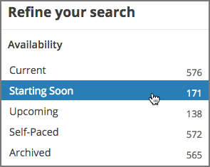
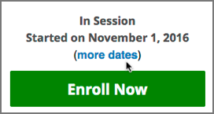
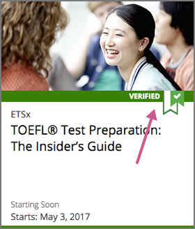
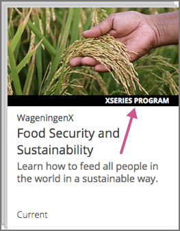
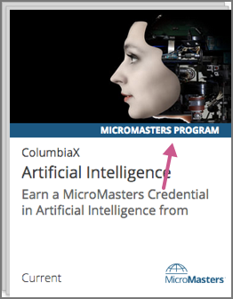
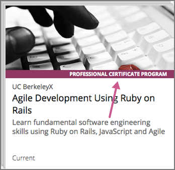

.. This file is for edX only; not included in Open edX version of the Learner's
.. Guide.

.. _SFD Enrolling in a Course:

####################################
Enrolling in edX Courses or Programs
####################################

EdX offers both individual :ref:`courses<About Courses>` and groups of related
courses, called :ref:`programs<About Programs>`.

To learn about a course or program, click the course or program in the `edX
course catalog`_, to view its About page. About pages provide information about
the course or program, including the course or program duration, the hours of
work that you should expect to spend each week, the institution that offers the
course or program, and the cost, if applicable, for certificates or academic
credit.

.. contents::
  :local:
  :depth: 1

For information about the types of certificates that are available and accessing
the certificates you earned, see :ref:`Certificates`.

For information about how to enroll in a certificate track for a course and how
to verify your identity for certificates, see :ref:`SFD Pursuing Certificate`.

.. _About Courses:

*****************
About edX Courses
*****************

When you consider :ref:`enrolling in an edX course<SFD Enroll in a Course>`,
you should understand these concepts.

.. contents::
  :local:
  :depth: 1

.. _Course Availability:

============================
When is a Course Available?
============================

Every course on edx.org has a status that tells you when it is available. When
you search for courses on edx.org, you can refine your search by availability.

.. note:: You can enroll in courses which have start dates in the future, but
   you cannot access course content or assignments before the start date.

* **Current** - the course is in session now.
* **Starting Soon** - the course will start within 60 days.
* **Upcoming** - the course will start in more than 60 days.
* **Archived** - the course has ended. You can only enroll in the audit track of
  an archived course. Once enrolled, you can access course materials, but you
  cannot receive a grade. Some features, such as course discussions and
  assignments, might not be available.

Some courses are offered at multiple times during the year. Most edX courses
are repeated, but scheduling is up to the individual course team.

If a course that you want to take is offered at other times in the future, a
**More Dates** option is available above the current course's start date
information and **Enroll Now** button. Select **More Dates** to see other
times that the course is offered, and enroll in any of the available times.

For more information, see :ref:`course start dates<Start Date and Duration>`
and :ref:`course pacing<SFD Course Pacing>`.

.. _Enrollment Tracks:

===========================================
What Enrollment Tracks Does a Course Offer?
===========================================

Most edX courses offer a choice of enrollment tracks. You can choose to take
a course for free, without the option of earning a certificate, or you can
take a course for a fee, with the option of earning a verified certificate.

For more information about enrolling in a course, see :ref:`SFD Enroll in a
Course`.

.. contents::
  :local:
  :depth: 1

.. _SFD About Audit Track:

About the Audit Track
*********************

Most courses offer an audit track. The audit track is free of charge, and does
not include a certificate when you complete your course. The audit track gives
you access to all course materials, including assignments and exams.

When you first enroll in a course, you are automatically enrolled in the audit
track. For information about enrolling in the audit track for a course, see
:ref:`Enroll in the Audit Track`.

If the course you enrolled in offers a verified track and the deadline for
enrolling in the verified track has not passed, you can choose to upgrade to the
verified track to earn a certificate. For more information, see :ref:`SFD Change
to the Verified Track`.

.. _SFD Verified Track:

About the Verified Track
*************************

Most courses offer a verified track in addition to the free audit track. The
verified track has a fee, and offers a certificate when you pass the course.

If a course has a verified track, you see a "Verified" indication on the course
image in the course catalog on edx.org. For a list of all courses that currently
offer verified certificates, see the `edX course catalog`_.

When you enroll in or :ref:`upgrade to the verified track<SFD Change to the
Verified Track>` in the course, you submit payment, and, some time before the
verification deadline, you must :ref:`verify your identity<SFD Verify Your
Identity>` using a webcam and a photo ID.

.. note:: The fee for the verified track varies by course. The amount of the fee
   is listed on the About page for that course. The fee helps support edX's
   mission. If you are unable to pay the verified track fee, you can apply for
   financial assistance using the `financial assistance application`_.

For more information about enrolling in the verified track for a course, see
:ref:`Enroll in the Verified Track` or :ref:`SFD Change to the Verified Track`.
For information about certificates, see :ref:`Certificates` or `Verified
Certificates`_.

.. _About Programs:

********************
About edX Programs
********************

In addition to taking individual edX courses, you can enroll in an entire series
of courses, called a program. Several types of program are available on edx.org.

.. contents::
  :local:
  :depth: 1

For a list of programs available on edx.org, see `edx Programs`_.

For information about enrolling in a program, see :ref:`SFD Enroll in a
Program`.

.. _About XSeries Programs:

============================
About XSeries Programs
============================

An XSeries program is a group of courses that together explore a specific
subject in depth. An XSeries program offers an XSeries certificate after you
earn a verified certificate for all of the courses in the program. All courses
in an XSeries program offer verified certificates. To complete an XSeries
program, you must earn a verified certificate in each of the courses in the
program.

XSeries programs have an "XSeries program" indication in the course catalog on
edx.org.

For more information about XSeries programs, see `XSeries Programs`_ on edx.org.

.. _About MicroMasters Programs:

============================
About MicroMasters Programs
============================

MicroMasters programs are a series of graduate level courses that you take for
credit in a specific career field. After you earn a MicroMasters certificate,
you can apply to a university that offers credit for those MicroMasters courses.
If you are accepted, you can then apply your MicroMasters credit toward a
master’s degree at that university.

MicroMasters programs have a "MicroMasters program" indication in the course
catalog on edx.org.

For more information about MicroMasters programs, see `MicroMasters Programs`_ on
edx.org.

.. _About ProfCert Programs:

========================================
About Professional Certificate Programs
========================================

Professional Certificate programs are a series of career-oriented courses that
teach critical skills in specific professional fields. Courses in a Professional
Certificate program offer verified certificates. To earn a certificate for a
Professional Certificate program, you must earn a verified certificate in each
of the courses in the program.

Professional certificate programs have a "Professional Certificate program"
indication in the course catalog on edx.org.

     indicator.

For more information about Professional Certificate programs, see
`Professional Certificate Programs`_ on edx.org.

.. _SFD Enroll in a Course:

********************************
Enrolling in a Course or Program
********************************

To take a course, you enroll in the course. To join a program, you enroll in any
course that is part of the program.

Courses or programs that you have enrolled in are added to the **Courses** and
**Programs** pages of your :ref:`dashboard<SFD Dashboard>`.

.. note:: Course instructors occasionally enroll learners directly in a
   course. If this is the case, you receive an email message that contains a
   link to the course. Click the link provided in the email message to enroll
   in the course.

.. contents::
  :local:
  :depth: 1

.. _Enroll in the Audit Track:

======================================
Enroll in the Audit Track for a Course
======================================

:ref:`Audit track<SFD About Audit Track>` enrollment allows you to take a
course free of charge. You do not receive a certificate when you complete the
course.

To enroll in the audit track for a course, follow these steps.

#. In the `edX course catalog`_, select the course that you want to take.

#. When the About page for the course opens, select **Enroll Now**.

   * If the course also offers a verified track, select **Audit this Course**.

   * In courses that offer only an audit track and in archived courses, you
     are enrolled immediately. In archived courses, you can access course
     content, but you cannot earn a grade.

#. If you are using a web browser, your course dashboard opens with a list of
   all of the courses you are enrolled in. To open the course, select **View
   Course**.

   If you are using the edX mobile app, the new course opens immediately.

You have the option to :ref:`upgrade to a verified certificate<SFD Change to
the Verified Track>` if the verification deadline for the course has not
passed.

.. _Enroll in the Verified Track:

=============================================
Enroll in the Verified Track for a Course
=============================================

:ref:`Verified track<SFD Verified Track>` enrollment requires that you pay for
the :ref:`verified certificate<SFD Verified Certificates>` and also
:ref:`verify your identity<SFD Verify Your Identity>` using a webcam and a
photo ID.

To pursue a verified certificate in a course, follow these steps.

#. In the `edX course catalog`_, courses that offer a verified track are shown
   with a "Verified" banner. Select the course that you want to take.

#. On the course About page, review information about the course including the
   price to enroll in the verified track of the course.

#. Select **Enroll Now**.

#. Select **Pursue a Verified Certificate**

#. To pay with a credit card, select **Checkout**. To pay with PayPal, select
   **Checkout with Paypal**.

   * Payment is in US dollars.

   * You must pay the verified track fee before you can begin the course.

   * You do not have to verify your identity immediately, but you
     must verify your identity before the course ID verification deadline has
     passed. For more information, see :ref:`SFD Verify Your Identity`.

#. If you are using a web browser, your course dashboard opens with a list of
   all of the courses you are enrolled in. To open the course, select **View
   Course**.

   If you are using the edX mobile app, the new course opens immediately.

.. _SFD Enroll in a Program:

===================
Enroll in a Program
===================

To enroll in a :ref:`program<About Programs>`, enroll in any course that is
part of that program. You do not need to complete any additional steps.

After you enroll in any course that is part of a program, that program is
listed on the **Programs** page on your learner dashboard. Select the card for
the program to go to a page that has more information about the program. On
this page, you can view your progress through the program, enroll in more of
the program's courses, and view any certificates that you have earned.

.. _Unenroll from a Course:

========================
Unenroll from a Course
========================

You can drop or unenroll from a course, but it is not necessary to do so. You
can simply stop viewing and working in the course, which will remain in the list
of courses on your dashboard.

If you unenroll from the verified track of a course within 14 days of your
payment or 14 days after the course start date, whichever is later, you can
receive a refund for the verified track fee. For more information about getting
a refund, see :ref:`Get a Refund`.

.. note:: If you unenroll from a course, the course is deleted from
   your dashboard, and you can no longer access course content or information
   about the grade or certificate you might have earned in the course.

To unenroll from a course, follow these steps.

#. On your dashboard, locate the course.

#. Select the course settings icon, then select **Unenroll**. The course is removed from your dashboard.

   .. image:: ../../shared/students/Images/settings_icon_unenroll.png
      :width: 300
      :alt: A learner's dashboard of courses with the course settings menu open
          for a course. An arrow indicates the Course Settings icon, and the
          Unenroll menu option is circled.

If you change your mind before the course ends, you can enroll in the course
again. Your status in the course, including your scores for all completed
assignments, is available as soon as you re-enroll.

.. include:: ../../links/links.rst
