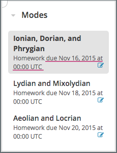

.. _SFD Course Pacing:

.. This file is only in the edX version of the Learner's Guide. There is no
.. equivalent in the Open edX version because it is not applicable.

######################################################
Differences Between Instructor- and Self-Paced Courses
######################################################

The pacing of a course refers to how course teams run the course, and how
learners can interact with the course material. Many courses are instructor-
paced: they follow a schedule that the instructor sets, with assignments and
exams that have specific due dates. In contrast, self-paced courses contain
assignments without due dates. You can progress through the course at your own
speed.

On the edx.org home page, an indication below a course's start date and above
the course's **Enroll Now** button lets you know if a course is self-paced. If
a course is not marked as self-paced, then it is instructor-paced.

.. contents::
 :local:
 :depth: 1

.. _SFD Instructor Paced:

*******************************
About Instructor-Paced Courses
*******************************

Instructor-paced courses follow a set schedule. The course team sets specific
due dates for assignments and exams, and you complete the course within a
defined time period, such as eight or twelve weeks.

Course materials become available at specific times as the course progresses.
Assignments have due dates, and exams have start and end dates. On the
**Course** page, indicators show when you have a graded assignment, as well as
the due date for the assignment.

    visible for graded homework assignments.

In most instructor-paced courses, certificates are generated within two weeks
of the end of the course.

For information about receiving certificates for an instructor-paced course,
see :ref:`SFD Receiving a Certificate`.

.. _SFD Self Paced:

*******************************
About Self-Paced Courses
*******************************

Self-paced courses do not follow a set schedule. Course materials are
completely available as soon as the course begins. Assignments and exams do
not have start or due dates. The course shows indicators for graded
assignments, but not due dates. You can complete assignments and exams at your
own pace, as long as you complete all course work before the course ends.

.. image:: ../../shared/students/Images/Pacing_Self.png
 :width: 200
 :alt: Part of the course page in a self-paced course, with no due dates
    for graded homework assignments.

In most self-paced courses, the course team generates certificates on a
schedule, such as once a month. The certificate generation schedule varies by
course.

For information about receiving a certificate for a self-paced course, see
:ref:`SFD Receiving a Certificate`.
